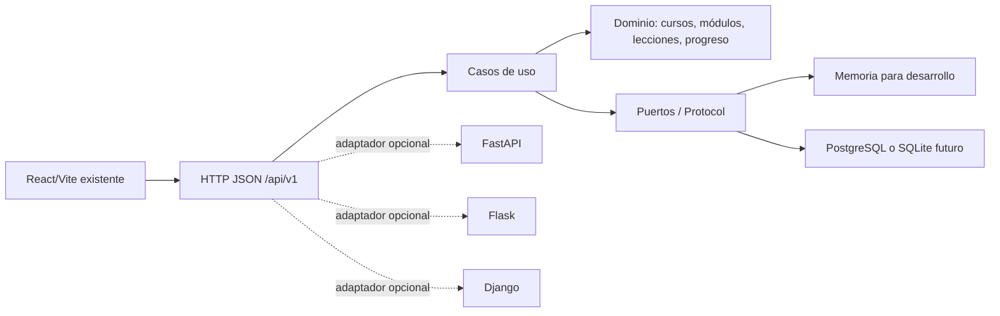

# Arquitectura Python multistack para Open School

## Objetivo

La propuesta introduce una base backend compatible con distintos despliegues sin alterar la aplicación educativa existente. La arquitectura sigue una separación por capas: el dominio no conoce HTTP, bases de datos ni frameworks; la aplicación coordina casos de uso; los adaptadores conectan infraestructura; y las interfaces exponen contratos estables.

## Diagrama

## Compatibilidad

| Escenario | Implementación recomendada | Dependencias obligatorias |
|---|---|---|
| Prototipo local | WSGI estándar + repositorio en memoria | Ninguna fuera de Python |
| API moderna | FastAPI + Uvicorn | Extra `api` |
| Hosting tradicional | Flask o mod_wsgi | Extra `flask` o servidor WSGI |
| Institución con ecosistema Django | Adaptador Django | Extra `django` |
| Producción | PostgreSQL tras un puerto de persistencia | Driver y migraciones del entorno |

## Montaje del mismo núcleo en cuatro hosts

El núcleo es una aplicación WSGI pura, de modo que cambiar de servidor no exige reescribir dominio, aplicación ni adaptadores. Cada host solo necesita una línea de montaje sobre el objeto `app` que expone `app.main`.

| Host | Montaje | Procedencia |
|---|---|---|
| Gunicorn o uWSGI | `gunicorn app.main:app` | servidor WSGI externo |
| Flask | `DispatcherMiddleware(flask_app, {"/api": app})` | `werkzeug.middleware.dispatcher`, extra `flask` |
| FastAPI | `router.mount("/api", WSGIMiddleware(app))` | `starlette.middleware.wsgi`, extra `api` |
| Django (ASGI) | `WsgiToAsgi(app)` bajo `/api/v1` | `asgiref.wsgi`, incluido en Django |

En los cuatro casos se conservan los contratos de `GET /health`, `GET /api/v1/catalog`, el rechazo `405` de métodos no `GET` y el `404` JSON de rutas desconocidas.

## Límites deliberados

Esta primera inyección no añade usuarios reales, pagos, permisos, contenido de cursos, migraciones ni secretos. Esos elementos requieren decisiones de producto y de infraestructura. Los contratos dejan un lugar estable para incorporarlos más adelante sin reescribir la interfaz.
