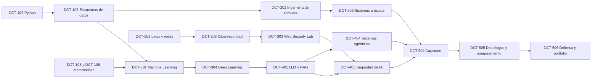

# D.I.C.T. — Marco curricular v1.0

> **Naturaleza del programa.** D.I.C.T. es un programa académico independiente. No otorga una titulación universitaria oficial, no atribuye reconocimiento estatal y sus **Créditos Académicos Internos (CA)** no son ECTS ni equivalen automáticamente a créditos universitarios oficiales.

El programa recorre diez semestres y 300 CA. Un CA representa 25 horas de dedicación académica estimada dentro de esta plataforma, incluyendo estudio, laboratorios, proyecto, revisión y evaluación. Esta convención es interna y sirve exclusivamente para planificar la carga de aprendizaje.

| Nivel | Denominación | Evidencia mínima de dominio |
| --- | --- | --- |
| A | Beginner | Ejecuta procedimientos guiados y explica el vocabulario básico. |
| B | Foundation | Resuelve tareas delimitadas con documentación y retroalimentación. |
| C | Intermediate | Integra conceptos en sistemas pequeños y justifica elecciones. |
| D | Advanced | Diseña, prueba y mejora sistemas con restricciones explícitas. |
| E | Professional | Entrega soluciones reproducibles, seguras y comunicables. |
| F | Research | Formula preguntas, experimenta, analiza evidencia y defiende conclusiones. |

## Calendario académico

| Semestre | Asignaturas | CA | Proyecto integrador | Nivel de salida |
| --- | --- | ---: | --- | --- |
| 1 | DCT-101 Fundamentos Digitales y Computación; DCT-102 Programación I con Python; DCT-103 Matemáticas y Método Académico I | 30 | Herramienta de línea de comandos documentada | B |
| 2 | DCT-104 Sistemas Web, Git y Colaboración; DCT-105 Programación II y Estructuras de Datos; DCT-106 Matemática Discreta y Estadística | 30 | Aplicación web estática accesible con repositorio y pruebas básicas | B |
| 3 | DCT-201 Ingeniería de Software y Bases de Datos; DCT-202 Sistemas Operativos, Linux y Redes; DCT-203 Álgebra Lineal, Probabilidad y Optimización | 30 | Servicio de datos con API, esquema y observabilidad inicial | C |
| 4 | DCT-204 Desarrollo Full Stack y Seguridad de APIs; DCT-205 Algoritmos, Arquitectura y Calidad; DCT-206 Fundamentos de Ciberseguridad | 30 | Producto full-stack defendido con modelo de amenazas | C |
| 5 | DCT-301 Machine Learning Aplicado; DCT-302 Cloud, DevOps y Entrega Continua; DCT-303 Ingeniería de Software Seguro y Web Security Lab | 30 | Sistema predictivo desplegable con pipeline y revisión de seguridad | D |
| 6 | DCT-304 Deep Learning y Computer Vision; DCT-305 Ingeniería de Datos y Analítica; DCT-306 Respuesta a Incidentes y Forense Digital | 30 | Plataforma de análisis con trazabilidad, monitorización y reporte técnico | D |
| 7 | DCT-401 Ingeniería de LLM y RAG; DCT-402 MLOps, IA Local y Serving; DCT-403 Seguridad de IA y Sistemas Adversariales | 30 | Asistente RAG local evaluado, protegido y documentado | E |
| 8 | DCT-404 Computación Agéntica y Orquestación; DCT-405 Sistemas Generativos Visuales y de Audio; DCT-406 Arquitectura Cloud Segura | 30 | Flujo multimodal o agéntico con permisos mínimos y revisión de riesgos | E |
| 9 | DCT-501 Investigación, Producto y Tecnología Responsable; DCT-502 Studio de Especialización; DCT-503 Ingeniería de Sistemas a Escala | 30 | Propuesta de investigación-producto con diseño de sistema y experimentos | F |
| 10 | DCT-504 Capstone: Investigación y Prototipo; DCT-505 Capstone: Despliegue y Aseguramiento; DCT-506 Capstone: Defensa y Portfolio | 30 | Sistema tecnológico completo, defendido y publicable | F |

## Política de evaluación

La configuración por defecto pondera teoría (15%), laboratorios (30%), proyecto (35%), investigación y documentación (10%) y examen o defensa (10%). Cada asignatura puede ajustar los pesos, pero no puede suprimir la evidencia práctica ni la demostración de competencia. Para aprobar se requiere una nota global de 65/100 y un mínimo de 60/100 en las dimensiones de laboratorio y proyecto.

| Dimensión de rúbrica | Pregunta de evaluación |
| --- | --- |
| Corrección y profundidad | ¿El resultado satisface los requisitos y explica sus límites? |
| Arquitectura y seguridad | ¿El diseño protege datos, dependencias, permisos y fallos previsibles? |
| Calidad de código | ¿El código es legible, probado, mantenible y revisable? |
| Reproducibilidad | ¿Otra persona puede repetir el proceso con documentación y versiones explícitas? |
| Investigación y criterio | ¿Las fuentes son adecuadas y las decisiones se sustentan en evidencia? |
| Comunicación | ¿La presentación y la defensa exponen decisiones, concesiones y riesgos con claridad? |

## Prerrequisitos bloqueantes prioritarios

## Entornos de laboratorio

| Laboratorio | Propósito | Ruta Low-end | Ruta Standard | Ruta GPU / Professional |
| --- | --- | --- | --- | --- |
| AI Lab | ML clásico, evaluación y experimentación. | CPU, 8 GB RAM, datasets reducidos. | CPU moderna, 16 GB RAM. | GPU para entrenamiento y visión intensiva. |
| LLM & Agent Lab | RAG, herramientas, permisos y evaluación. | Modelos cuantizados locales o inferencia de ejemplo. | 16 GB RAM, modelos pequeños y serving local. | GPU para fine-tuning y evaluación a mayor escala. |
| Cyber Lab | Seguridad web, redes, detección y respuesta. | Máquinas virtuales ligeras y aplicaciones vulnerables locales. | 16 GB RAM, dos o más entornos aislados. | No requerida; GPU opcional para análisis especializado. |
| Cloud Lab | Contenedores, CI/CD, observabilidad e infraestructura. | Simulación local y créditos educativos cuando existan. | Contenedores y servicios locales. | No requerida. |
| Creative AI Lab | Visión, imagen, audio y narrativa asistida. | Edición y modelos ligeros; muestras de baja resolución. | 16 GB RAM y almacenamiento adicional. | GPU recomendada para difusión, vídeo y entrenamiento. |

Los laboratorios de seguridad son exclusivamente didácticos, aislados y autorizados. Las prácticas no instruyen ni permiten atacar sistemas reales sin permiso expreso. La biblioteca priorizará documentación oficial, universidades, papers, repositorios con licencia clara, datasets apropiados y proyectos open source mantenidos.

## Referencias académicas seleccionadas

La biblioteca del catálogo enlazará el curso de LLM de Hugging Face, que exige un buen nivel de Python y cubre Transformers, Datasets, Tokenizers, demostraciones y temas avanzados, como recurso posterior a los fundamentos.[1] Los módulos de seguridad web se apoyarán en la Web Security Testing Guide de OWASP y en laboratorios aislados.[2] La interfaz seguirá las recomendaciones de WCAG 2.2 para acceso por teclado, contraste, alternativas de contenido y diseño adaptable.[3]

[1]: https://huggingface.co/learn/llm-course/en/chapter1/1 "Hugging Face — LLM Course"
[2]: https://owasp.org/www-project-web-security-testing-guide/ "OWASP — Web Security Testing Guide"
[3]: https://www.w3.org/TR/WCAG22/ "W3C — Web Content Accessibility Guidelines (WCAG) 2.2"
