# Mapa descriptivo — GitHub `belentani7`

Generado: **2026-09-13T08:35:22+00:00**  
**Alcance:** perfil y ficha de repositorio (nombre, descripción, lenguaje, topics, estado, rama por defecto, fechas, Pages, visibilidad). **No** se leyeron archivos, README, código, commits, ramas, ni issues.

> Las relaciones entre repositorios son **inferidas de metadatos compartidos** (topics, palabras de la descripción, lenguaje, raíz del nombre). No son dependencias técnicas verificadas.

---

## 1. Nodo raíz — el perfil

| Campo | Valor |
|---|---|
| Login | `belentani7` |
| Nombre visible | Belentani |
| Organización | Noiacore |
| Ubicación | L'Hospitalet de Llobregat, Barcelona |
| Sitio | https://belentani.vercel.app |
| Biografía | Neural Architect · Voice cloning · Zero-token AI routing · Creative systems · Full-Stack TS/Python/Java · São Paulo → Barcelona |
| Repos públicos (GitHub) | 125 |
| Seguidores / siguiendo | 0 / 0 |
| Cuenta creada | 2025-09-07T01:10:51Z |
| Perfil actualizado | 2026-09-11T11:27:50Z |

## 2. Totales verificados

| Indicador | Valor |
|---|---|
| repos visibles | **502** |
| publicos | **125** |
| privados | **377** |
| activos | **298** |
| archivados | **204** |
| con pages | **83** |
| sin descripcion | **190** |
| clientes | **27** |

**Lenguajes declarados** (lenguaje principal del repo):

| Lenguaje | Repos |
|---|---|
| TypeScript | 174 |
| HTML | 111 |
| Python | 101 |
| — | 55 |
| JavaScript | 21 |
| PowerShell | 12 |
| CSS | 9 |
| Go | 5 |
| Shell | 4 |
| Java | 3 |
| Jupyter Notebook | 2 |
| C++ | 1 |
| Rust | 1 |
| Batchfile | 1 |
| Makefile | 1 |
| C | 1 |

## 3. Clusters

| Cluster | Repos | Qué agrupa |
|---|---|---|
| `otro` | 106 | Sin señal suficiente en los metadatos |
| `archivo_privado` | 73 | Archivos, snapshots y exports de preservación |
| `ia_skills` | 66 | Skills, agentes, protocolos, validación, infraestructura de IA |
| `duck` | 61 | Núcleo creativo-operativo DUCK/Zion: OS, estudio, audio, apps |
| `creativo_portfolio` | 52 | Portfolio, experiencias inmersivas, marca Judas |
| `educacion` | 30 | Escuelas, universidades, cursos, idiomas, contenido abierto |
| `musica_audio` | 30 | Producción musical, audio, VFX, generación de vídeo |
| `infra_so` | 30 | Entornos, workspaces, shells y sistemas operativos web |
| `servicios` | 18 | Servicios y trabajos para terceros (ver aviso de clientes) |
| `civico_acogida` | 17 | Información práctica y acogida (migrantes, derechos) |
| `literario_ensayo` | 7 | Ensayo, literatura, obra editorial y pensamiento |
| `industrial_3d` | 5 | Fabricación aditiva, CAD, 3D e integración industrial |
| `educacion_emocional` | 5 | Comprensión emocional, vínculos, límites |
| `contenido_media` | 2 | Contenido vertical, vídeo, storyboard y orquestación |

## 4. Red educativa — interconexiones

Repos con señal educativa: **118**  
Desglose: `educacion`=30, `civico_acogida`=17, `educacion_emocional`=5, `ia_skills`=66

### 4.1 Grafo

```mermaid
graph TD
  BEL["BELENTANI / belentani7<br/>nodo de identidad"]
  DUCK["DUCK<br/>núcleo creativo-operativo"]
  BEL --> DUCK
  BEL --> EDUCACION[educacion]
  DUCK -.-> EDUCACION
  BEL --> CIVICO_ACOGIDA[civico_acogida]
  DUCK -.-> CIVICO_ACOGIDA
  BEL --> EDUCACION_EMOCIONAL[educacion_emocional]
  DUCK -.-> EDUCACION_EMOCIONAL
  BEL --> IA_SKILLS[ia_skills]
  DUCK -.-> IA_SKILLS
  R0["ManosAbiertas-backup-v1<br/>TypeScript"]
  CIVICO_ACOGIDA --> R0
  R1["ux-academy-professional-program<br/>TypeScript"]
  EDUCACION --> R1
  R2["WILLIAMSCHOOL<br/>TypeScript"]
  EDUCACION --> R2
  R3["open-school<br/>TypeScript"]
  EDUCACION --> R3
  R4["ManosAbiertas<br/>HTML"]
  CIVICO_ACOGIDA --> R4
  R5["linguaforge<br/>TypeScript"]
  EDUCACION --> R5
  R6["lingua-aberta<br/>TypeScript"]
  EDUCACION --> R6
  R7["aprende-brasil<br/>TypeScript"]
  EDUCACION --> R7
  R8["secure-t-university<br/>HTML"]
  EDUCACION --> R8
  R9["belentani7<br/>TypeScript"]
  EDUCACION --> R9
  R10["pvc-u-core<br/>Python"]
  EDUCACION --> R10
  R11["belentani-monorepo<br/>Java"]
  CIVICO_ACOGIDA --> R11
  R12["Belentani<br/>TypeScript"]
  IA_SKILLS --> R12
  R13["Cruzando-el-charco<br/>HTML"]
  CIVICO_ACOGIDA --> R13
  R14["william.game<br/>TypeScript"]
  EDUCACION --> R14
  R15["noiacore-lab-audited<br/>TypeScript"]
  IA_SKILLS --> R15
  R16["noiacore-lab<br/>TypeScript"]
  IA_SKILLS --> R16
  R17["latam-europa<br/>TypeScript"]
  CIVICO_ACOGIDA --> R17
  R18["belentani.new<br/>TypeScript"]
  IA_SKILLS --> R18
  R19["belentani-sovereign-core<br/>TypeScript"]
  EDUCACION --> R19
  R20["belentani-atlas<br/>TypeScript"]
  EDUCACION --> R20
  R21["aion-workforce-enterprise<br/>TypeScript"]
  IA_SKILLS --> R21
  R22["agent-control-plane<br/>TypeScript"]
  IA_SKILLS --> R22
  R23["linguaforge-v2<br/>TypeScript"]
  EDUCACION --> R23
  R24["cruzando-el-charco-v2<br/>TypeScript"]
  CIVICO_ACOGIDA --> R24
  R25["skillforge<br/>Python"]
  EDUCACION --> R25
  R26["belentani-infrastructure-core<br/>Python"]
  IA_SKILLS --> R26
  R27["tender-words-connect-v2<br/>TypeScript"]
  EDUCACION_EMOCIONAL --> R27
  R28["secure-t-platform<br/>TypeScript"]
  EDUCACION --> R28
  R29["pedro-premium-hub<br/>Python"]
  IA_SKILLS --> R29
  R30["noiacore-registry<br/>HTML"]
  IA_SKILLS --> R30
  R31["noiacore-os<br/>JavaScript"]
  IA_SKILLS --> R31
  R32["noiacore-lab-consciousness<br/>HTML"]
  IA_SKILLS --> R32
  R33["mimocode-skills<br/>Python"]
  IA_SKILLS --> R33
  R34["MetaSkill<br/>Python"]
  IA_SKILLS --> R34
  R35["claude-skills<br/>Python"]
  IA_SKILLS --> R35
  R36["aion-showcase<br/>HTML"]
  IA_SKILLS --> R36
  R37["universal-impact-suite-index<br/>—"]
  EDUCACION --> R37
  R38["Steven-renovation<br/>HTML"]
  EDUCACION --> R38
  R39["skills-marketplace<br/>—"]
  IA_SKILLS --> R39
  R40["registro-proyectos-2026<br/>HTML"]
  IA_SKILLS --> R40
  R41["maestro-supremo-repo-audit-protocol<br/>—"]
  IA_SKILLS --> R41
  R42["cli-coder-patterns<br/>—"]
  EDUCACION --> R42
  R43["claude-skills-full<br/>—"]
  IA_SKILLS --> R43
  R44["belentani-alibaba-integration<br/>—"]
  IA_SKILLS --> R44
  R45["secure-t<br/>TypeScript"]
  EDUCACION --> R45
  R46["secure-t-app<br/>TypeScript"]
  EDUCACION --> R46
  R47["NOIACORE<br/>HTML"]
  IA_SKILLS --> R47
  R48["agentguard<br/>Go"]
  IA_SKILLS --> R48
  R49["noiacore-art-lab<br/>TypeScript"]
  IA_SKILLS --> R49
  R50["premium-effects-registry<br/>Python"]
  IA_SKILLS --> R50
  R51["skills-registry<br/>TypeScript"]
  IA_SKILLS --> R51
  R52["premium-effects<br/>Python"]
  IA_SKILLS --> R52
  R53["noiacore-labs<br/>CSS"]
  IA_SKILLS --> R53
  R54["agent-linux<br/>Shell"]
  IA_SKILLS --> R54
  R55["secure-t-v2<br/>TypeScript"]
  EDUCACION --> R55
  R56["secure-t-archive<br/>TypeScript"]
  EDUCACION --> R56
  R57["securetea<br/>JavaScript"]
  IA_SKILLS --> R57
  R58["pvc-u-frontend<br/>TypeScript"]
  IA_SKILLS --> R58
  R59["manos-abiertas-2026<br/>HTML"]
  CIVICO_ACOGIDA --> R59
  R60["lingua-aberta-empresa<br/>TypeScript"]
  EDUCACION --> R60
  R61["william-game<br/>HTML"]
  EDUCACION --> R61
  R62["manus-ai-skill-pack<br/>Python"]
  IA_SKILLS --> R62
  R63["manos-abiertas-docs<br/>TypeScript"]
  CIVICO_ACOGIDA --> R63
  R64["Belentani-Agency-AI-Omega<br/>Python"]
  IA_SKILLS --> R64
  R65["noiacore-theme<br/>CSS"]
  IA_SKILLS --> R65
  R66["instituto-universal<br/>CSS"]
  EDUCACION --> R66
  R67["proofmesh<br/>TypeScript"]
  IA_SKILLS --> R67
  R68["harmonia-hub<br/>TypeScript"]
  EDUCACION_EMOCIONAL --> R68
  R69["omniagent<br/>Python"]
  IA_SKILLS --> R69
  R70["claude-skills-pack<br/>HTML"]
  IA_SKILLS --> R70
  R71["meta-skill<br/>HTML"]
  IA_SKILLS --> R71
  R72["qbp-core<br/>Python"]
  IA_SKILLS --> R72
  R73["evidence-ledger<br/>HTML"]
  IA_SKILLS --> R73
  R74["tender-words-connect<br/>TypeScript"]
  EDUCACION_EMOCIONAL --> R74
  R75["belentaniexperience<br/>TypeScript"]
  IA_SKILLS --> R75
  R76["oss-compass<br/>Python"]
  EDUCACION --> R76
  R77["noiacore-model-guard<br/>TypeScript"]
  IA_SKILLS --> R77
  R78["noiacore-turbo-v2<br/>Python"]
  IA_SKILLS --> R78
  R79["swarm<br/>Go"]
  IA_SKILLS --> R79
  R80["agentbox<br/>Go"]
  IA_SKILLS --> R80
  R81["abrazo-tender-words<br/>TypeScript"]
  EDUCACION_EMOCIONAL --> R81
  R82["manosabiertas-components<br/>TypeScript"]
  CIVICO_ACOGIDA --> R82
  R83["manosabiertas-38d5f<br/>TypeScript"]
  CIVICO_ACOGIDA --> R83
  R84["Oculus-Tv<br/>TypeScript"]
  EDUCACION --> R84
  R85["nataliamarinho<br/>HTML"]
  EDUCACION --> R85
  R86["local-agent-3<br/>PowerShell"]
  IA_SKILLS --> R86
  R87["local-agent-2<br/>PowerShell"]
  IA_SKILLS --> R87
  R88["computer-agent<br/>Rust"]
  IA_SKILLS --> R88
  R89["agentmail-toolkit<br/>TypeScript"]
  IA_SKILLS --> R89
  R90["agentmail-python<br/>Python"]
  IA_SKILLS --> R90
  R91["agentmail-mcp<br/>TypeScript"]
  IA_SKILLS --> R91
  R92["agenticseek<br/>Python"]
  IA_SKILLS --> R92
  R93["opencodex<br/>TypeScript"]
  IA_SKILLS --> R93
  R94["claudecode-ritheshh<br/>Python"]
  IA_SKILLS --> R94
  R95["free-claude-code-simplesunny<br/>Python"]
  IA_SKILLS --> R95
  R96["free-claude-code-alishahryar1<br/>Python"]
  IA_SKILLS --> R96
  R97["agent-browser-mcp<br/>Python"]
  IA_SKILLS --> R97
  R98["manosabiertas-optimizacion-2<br/>HTML"]
  CIVICO_ACOGIDA --> R98
  R99["swe-agent<br/>Python"]
  IA_SKILLS --> R99
  R100["meta-design-skill<br/>—"]
  IA_SKILLS --> R100
  R101["manosabiertas-vercel-20260813<br/>TypeScript"]
  CIVICO_ACOGIDA --> R101
  R102["universal-web-architecture-template<br/>PowerShell"]
  EDUCACION --> R102
  R103["tender-words-connect-main<br/>TypeScript"]
  EDUCACION_EMOCIONAL --> R103
  R104["manos-abiertas<br/>JavaScript"]
  CIVICO_ACOGIDA --> R104
  R105["manos-abiertas-release-netlify-20260812<br/>TypeScript"]
  CIVICO_ACOGIDA --> R105
  R106["manosabiertas-repo<br/>TypeScript"]
  CIVICO_ACOGIDA --> R106
  R107["belentani-omega-os-codex-07-31<br/>HTML"]
  IA_SKILLS --> R107
  R108["codex-mesh<br/>PowerShell"]
  IA_SKILLS --> R108
  R109["clon-manosabiertas<br/>HTML"]
  CIVICO_ACOGIDA --> R109
  R110["cruzando-el-charco-web<br/>TypeScript"]
  CIVICO_ACOGIDA --> R110
  R111["CODEX-OMEGA-SKILL<br/>PowerShell"]
  IA_SKILLS --> R111
  R112["noiacore-revenue-pipeline<br/>Python"]
  IA_SKILLS --> R112
  R113["maos-abertas-linguaforge<br/>TypeScript"]
  EDUCACION --> R113
  R114["belentani7-gestaltAI<br/>—"]
  IA_SKILLS --> R114
  R115["agent-orchestration-machine<br/>Python"]
  IA_SKILLS --> R115
  R116["caveman-skill<br/>JavaScript"]
  IA_SKILLS --> R116
  R117["local-agent<br/>PowerShell"]
  IA_SKILLS --> R117
  R34 ---|75| R71
  R0 ---|25| R84
  R67 ---|23| R76
  R67 ---|22| R73
  R74 ---|22| R81
  R0 ---|21| R13
  R0 ---|19| R4
  R45 ---|18| R55
  R6 ---|16| R14
  R95 ---|16| R96
  R27 ---|15| R74
  R51 ---|15| R64
  R51 ---|15| R71
  R4 ---|14| R13
  R9 ---|14| R75
  R13 ---|14| R84
  R67 ---|14| R75
  R9 ---|13| R13
  R34 ---|13| R64
  R54 ---|13| R71
  R73 ---|13| R76
  R24 ---|12| R110
  R54 ---|12| R67
  R64 ---|12| R71
  R64 ---|12| R80
  R104 ---|12| R105
  R13 ---|11| R24
  R13 ---|11| R110
  R16 ---|11| R47
  R47 ---|11| R71
  R59 ---|11| R63
  R59 ---|11| R104
  R63 ---|11| R104
  R67 ---|11| R84
  R0 ---|10| R3
  R12 ---|10| R75
  R27 ---|10| R103
  R34 ---|10| R54
  R73 ---|10| R75
  R73 ---|10| R84
```



### 4.2 Aristas con más señal (peso ≥8)

| Repo A | Repo B | Peso | Señal compartida |
|---|---|---|---|
| `MetaSkill` | `meta-skill` | 75 | topics: ai-coding, claude-code, cost-control, llm-router, model-routing, token-optimization; palabras: agents, burning, claude, code, coding |
| `ManosAbiertas-backup-v1` | `Oculus-Tv` | 25 | topics: accessibility, education, multilingual; palabras: accessibility, education, multilingual, multilingue; mismo lenguaje |
| `proofmesh` | `oss-compass` | 23 | topics: ai-safety, open-source; palabras: node, open, safety, source, with |
| `proofmesh` | `evidence-ledger` | 22 | topics: open-source; palabras: audit, evidence, first, open, safety |
| `tender-words-connect` | `abrazo-tender-words` | 22 | palabras: comprension, gestion, herramientas, mapa, sobre; mismo lenguaje |
| `ManosAbiertas-backup-v1` | `Cruzando-el-charco` | 21 | topics: accessibility, multilingual, nextjs; palabras: accessibility, multilingual, nextjs |
| `ManosAbiertas-backup-v1` | `ManosAbiertas` | 19 | topics: education; palabras: cursos, education, educativa, manosabiertas, plataforma |
| `secure-t` | `secure-t-v2` | 18 | misma raíz de nombre; palabras: ciberseguridad, digital, secure, universidad; mismo lenguaje |
| `lingua-aberta` | `william.game` | 16 | palabras: catalan, construido, espanol, ingles, manus; mismo lenguaje |
| `free-claude-code-simplesunny` | `free-claude-code-alishahryar1` | 16 | palabras: backup, claude, code, free, local; mismo lenguaje |
| `tender-words-connect-v2` | `tender-words-connect` | 15 | misma raíz de nombre; palabras: connect, tender, words; mismo lenguaje |
| `skills-registry` | `Belentani-Agency-AI-Omega` | 15 | palabras: claude, cline, code, qwen, skills |
| `skills-registry` | `meta-skill` | 15 | palabras: agent, claude, code, qwen, skill |
| `ManosAbiertas` | `Cruzando-el-charco` | 14 | topics: social-impact; palabras: impact, migrantes, social; mismo lenguaje |
| `belentani7` | `belentaniexperience` | 14 | topics: portfolio; palabras: belentani, creative, portfolio; mismo lenguaje |
| `Cruzando-el-charco` | `Oculus-Tv` | 14 | topics: accessibility, multilingual; palabras: accessibility, multilingual |
| `proofmesh` | `belentaniexperience` | 14 | topics: typescript; palabras: intelligence, safety, typescript; mismo lenguaje |
| `belentani7` | `Cruzando-el-charco` | 13 | topics: accessibility; palabras: accessibility, belentani, noiacore |
| `MetaSkill` | `Belentani-Agency-AI-Omega` | 13 | palabras: claude, code, coding, qwen; mismo lenguaje |
| `agent-linux` | `meta-skill` | 13 | topics: claude-code; palabras: agent, claude, code |
| `evidence-ledger` | `oss-compass` | 13 | topics: open-source; palabras: open, safety, source |
| `cruzando-el-charco-v2` | `cruzando-el-charco-web` | 12 | misma raíz de nombre; palabras: charco, cruzando; mismo lenguaje |
| `agent-linux` | `proofmesh` | 12 | palabras: code, developer, tools, with |
| `Belentani-Agency-AI-Omega` | `meta-skill` | 12 | palabras: claude, code, coding, qwen |
| `Belentani-Agency-AI-Omega` | `agentbox` | 12 | palabras: aider, claude, codex, qwen |
| `manos-abiertas` | `manos-abiertas-release-netlify-20260812` | 12 | palabras: abiertas, backup, local, manos |
| `Cruzando-el-charco` | `cruzando-el-charco-v2` | 11 | misma raíz de nombre; palabras: charco, cruzando |
| `Cruzando-el-charco` | `cruzando-el-charco-web` | 11 | misma raíz de nombre; palabras: charco, cruzando |
| `noiacore-lab` | `NOIACORE` | 11 | misma raíz de nombre; palabras: multi, noiacore |
| `NOIACORE` | `meta-skill` | 11 | topics: ai-agents; palabras: agent, agents; mismo lenguaje |
| `manos-abiertas-2026` | `manos-abiertas-docs` | 11 | misma raíz de nombre; palabras: abiertas, manos |
| `manos-abiertas-2026` | `manos-abiertas` | 11 | misma raíz de nombre; palabras: abiertas, manos |
| `manos-abiertas-docs` | `manos-abiertas` | 11 | misma raíz de nombre; palabras: abiertas, manos |
| `proofmesh` | `Oculus-Tv` | 11 | topics: open-source; palabras: open, source; mismo lenguaje |
| `ManosAbiertas-backup-v1` | `open-school` | 10 | palabras: accesibilidad, cursos, offline; mismo lenguaje |
| `Belentani` | `belentaniexperience` | 10 | palabras: automatizacion, belentani, pedro; mismo lenguaje |
| `tender-words-connect-v2` | `tender-words-connect-main` | 10 | palabras: connect, tender, words; mismo lenguaje |
| `MetaSkill` | `agent-linux` | 10 | topics: claude-code; palabras: claude, code |
| `evidence-ledger` | `belentaniexperience` | 10 | topics: trust-and-safety; palabras: safety, trust |
| `evidence-ledger` | `Oculus-Tv` | 10 | topics: open-source; palabras: open, source |
| `tender-words-connect` | `tender-words-connect-main` | 10 | palabras: connect, tender, words; mismo lenguaje |
| `oss-compass` | `Oculus-Tv` | 10 | topics: open-source; palabras: open, source |
| `manosabiertas-38d5f` | `manosabiertas-vercel-20260813` | 10 | palabras: backup, local, manosabiertas; mismo lenguaje |
| `manosabiertas-38d5f` | `manosabiertas-repo` | 10 | palabras: backup, local, manosabiertas; mismo lenguaje |
| `local-agent-3` | `local-agent-2` | 10 | palabras: agent, backup, local; mismo lenguaje |
| `agentmail-toolkit` | `agentmail-mcp` | 10 | palabras: agentmail, backup, local; mismo lenguaje |
| `agent-browser-mcp` | `swe-agent` | 10 | palabras: agent, backup, local; mismo lenguaje |
| `manosabiertas-optimizacion-2` | `clon-manosabiertas` | 10 | palabras: backup, local, manosabiertas; mismo lenguaje |
| `manosabiertas-vercel-20260813` | `manosabiertas-repo` | 10 | palabras: backup, local, manosabiertas; mismo lenguaje |
| `ManosAbiertas-backup-v1` | `nataliamarinho` | 9 | palabras: educativa, multilingue, plataforma |
| `linguaforge` | `linguaforge-v2` | 9 | misma raíz de nombre; palabras: linguaforge; mismo lenguaje |
| `Belentani` | `Cruzando-el-charco` | 9 | palabras: belentani, noiacore, pedro |
| `belentani.new` | `Steven-renovation` | 9 | palabras: comercial, github, servicios |
| `MetaSkill` | `cli-coder-patterns` | 9 | palabras: agents, coding, context |
| `MetaSkill` | `skills-registry` | 9 | palabras: claude, code, qwen |
| `MetaSkill` | `agentbox` | 9 | palabras: agents, claude, qwen |
| `cli-coder-patterns` | `NOIACORE` | 9 | palabras: agent, agents, multi |
| `cli-coder-patterns` | `meta-skill` | 9 | palabras: agent, agents, coding |
| `NOIACORE` | `swarm` | 9 | palabras: agent, intelligence, multi |
| `skills-registry` | `agent-linux` | 9 | palabras: agent, claude, code |
| `skills-registry` | `manus-ai-skill-pack` | 9 | palabras: claude, skill, skills |
| `manus-ai-skill-pack` | `claude-skills-pack` | 9 | palabras: claude, pack, skills |
| `Belentani-Agency-AI-Omega` | `claude-skills-pack` | 9 | palabras: claude, coding, skills |
| `Belentani-Agency-AI-Omega` | `belentani-omega-os-codex-07-31` | 9 | palabras: belentani, codex, omega |
| `Belentani-Agency-AI-Omega` | `CODEX-OMEGA-SKILL` | 9 | palabras: belentani, codex, omega |
| `meta-skill` | `agentbox` | 9 | palabras: agents, claude, qwen |
| `manosabiertas-38d5f` | `manosabiertas-optimizacion-2` | 9 | palabras: backup, local, manosabiertas |
| `manosabiertas-38d5f` | `clon-manosabiertas` | 9 | palabras: backup, local, manosabiertas |
| `local-agent-3` | `computer-agent` | 9 | palabras: agent, backup, local |
| `local-agent-3` | `agent-browser-mcp` | 9 | palabras: agent, backup, local |
| `local-agent-3` | `swe-agent` | 9 | palabras: agent, backup, local |
| `local-agent-2` | `computer-agent` | 9 | palabras: agent, backup, local |
| `local-agent-2` | `agent-browser-mcp` | 9 | palabras: agent, backup, local |
| `local-agent-2` | `swe-agent` | 9 | palabras: agent, backup, local |
| `computer-agent` | `agent-browser-mcp` | 9 | palabras: agent, backup, local |
| `computer-agent` | `swe-agent` | 9 | palabras: agent, backup, local |
| `agentmail-toolkit` | `agentmail-python` | 9 | palabras: agentmail, backup, local |
| `agentmail-python` | `agentmail-mcp` | 9 | palabras: agentmail, backup, local |
| `manosabiertas-optimizacion-2` | `manosabiertas-vercel-20260813` | 9 | palabras: backup, local, manosabiertas |
| `manosabiertas-optimizacion-2` | `manosabiertas-repo` | 9 | palabras: backup, local, manosabiertas |
| `manosabiertas-vercel-20260813` | `clon-manosabiertas` | 9 | palabras: backup, local, manosabiertas |
| `manosabiertas-repo` | `clon-manosabiertas` | 9 | palabras: backup, local, manosabiertas |
| `belentani-omega-os-codex-07-31` | `codex-mesh` | 9 | palabras: backup, codex, local |
| `belentani-omega-os-codex-07-31` | `CODEX-OMEGA-SKILL` | 9 | palabras: belentani, codex, omega |
| `ManosAbiertas-backup-v1` | `ux-academy-professional-program` | 8 | topics: education; palabras: education; mismo lenguaje |
| `ManosAbiertas-backup-v1` | `belentani7` | 8 | topics: accessibility; palabras: accessibility; mismo lenguaje |
| `ManosAbiertas-backup-v1` | `proofmesh` | 8 | topics: typescript; palabras: typescript; mismo lenguaje |
| `ManosAbiertas-backup-v1` | `belentaniexperience` | 8 | topics: typescript; palabras: typescript; mismo lenguaje |
| `ux-academy-professional-program` | `Oculus-Tv` | 8 | topics: education; palabras: education; mismo lenguaje |
| `belentani7` | `Oculus-Tv` | 8 | topics: accessibility; palabras: accessibility; mismo lenguaje |

### 4.3 Interconexión textual

```text
                        BELENTANI  (identidad)
                             │
        ┌────────────────────┼────────────────────┐
        │                    │                    │
   EDUCACIÓN ABIERTA   EDUCACIÓN EMOCIONAL   EDUCACIÓN TÉCNICA
   + CÍVICA            (vínculos/límites)    (skills/IA)
        │                    │                    │
   [educacion] 30 repos
      · Steven-renovation
      · WILLIAMSCHOOL
      · aprende-brasil
      · belentani-atlas
      · belentani-sovereign-core
      · belentani7
      · cli-coder-patterns
      · instituto-universal
      · lingua-aberta
      · lingua-aberta-empresa
      · linguaforge
      · maos-abertas-linguaforge
      · nataliamarinho
      · open-school
   [civico_acogida] 17 repos
      · Cruzando-el-charco
      · ManosAbiertas
      · belentani-monorepo
      · latam-europa
      · manos-abiertas-2026
      · ManosAbiertas-backup-v1 (archivado)
      · clon-manosabiertas (archivado)
      · cruzando-el-charco-v2 (archivado)
      · cruzando-el-charco-web (archivado)
      · manos-abiertas (archivado)
      · manos-abiertas-docs (archivado)
      · manos-abiertas-release-netlify-20260812 (archivado)
      · manosabiertas-38d5f (archivado)
      · manosabiertas-components (archivado)
   [educacion_emocional] 5 repos
      · harmonia-hub
      · tender-words-connect
      · abrazo-tender-words (archivado)
      · tender-words-connect-main (archivado)
      · tender-words-connect-v2 (archivado)
   [ia_skills] 66 repos
      · Belentani
      · Belentani-Agency-AI-Omega
      · MetaSkill
      · NOIACORE
      · agent-control-plane
      · agent-linux
      · agent-orchestration-machine
      · agentbox
      · agentguard
      · aion-showcase
      · aion-workforce-enterprise
      · belentani-alibaba-integration
      · belentani-infrastructure-core
      · belentani.new

             └──────────────┬──────────────┘
                            ▼
                    DUCK  (núcleo creativo-operativo)
      · duck-unified-master
      · duck-studio-unified
      · duck-studio-maker-export
      · duck-studio-delivery
      · duck-lucas-artista
      · duck-ecosystem-v2
      · duck-belentani-os-audited-2026-08-23
      · belentani-unified
      · heyduck-rebuild
      · duck-lab-music-creator
      · DUCK-A-GEMA-1-LAB
      · duckweb-belentani-export
      · duck-zion-studio
      · DUCK-ZION-GITHUB
      · DUCK-STUDIO-WIN11
      · duck-studio-os-v2
      · duck-studio-os-protected
      · DUCK-STUDIO-LOCAL-WIN11
      · duck-producao-musical-chat-archive-2026-08-22
      · DUCK-MUSIC-PRODUCER-v1.0.0
      · duck-docs
      · Duck-Omega
      · duck-2026
      · duck-ecosystem
      · DuckHTML
      · 03-DUCK-WEB-build-everything-drive
      · 03-DUCK-WEB-build-everything
      · heyduck
      · duck-hub
      · duck-lab
      · omega-max-duck
      · DUCK-ZION-PREMIUM
      · duck-zion-apex-public
      · duck-studio-suite
      · duck-full-studio-pro
      · Duck-Deck
      · duck-music-lab
      · duck-apps-web
      · duck-apps
      · heyduck-4
      · heyduck-3
      · duck-zion-premium-2
      · duck-unified-master-2
      · duck-stdio
      · duck-ecosystem-inspect
      · heyduck-2
      · duck-full-studio-pro-2
      · duck-2026-2
      · duck-2000-2
      · heyduck-github-12scripts
      · heyduck-belentani7
      · duck-repo-final
      · duck-portfolio
      · duck-2000
      · DUCK-ZION-PREMIUM-audited
      · duck-unified-master-audited
      · duck-zion-portal-clientes
      · duck-zion-ecosystem
      · duck-zion-studio-os
      · zion-causal-intelligence
      · duck-producao-musical
```

## 5. DUCK — núcleo creativo

Repos en el cluster DUCK: **61**

| Repo | Lenguaje | Rama | Estado | Descripción |
|---|---|---|---|---|
| [`duck-unified-master`](https://github.com/belentani7/duck-unified-master) | HTML | `main` | archivado | DUCK ecosystem consolidation — 9 repos unified into one monorepo with apps, docs, and shar |
| [`duck-studio-unified`](https://github.com/belentani7/duck-studio-unified) | TypeScript | `main` | activo | Duck Studio Unified — plataforma artística, portal de clientes y operação supervisionada |
| [`duck-studio-maker-export`](https://github.com/belentani7/duck-studio-maker-export) | TypeScript | `main` | archivado | Duck Studio Maker - exportacion del generador de estudios DUCK. |
| [`duck-studio-delivery`](https://github.com/belentani7/duck-studio-delivery) | TypeScript | `main` | activo | — |
| [`duck-lucas-artista`](https://github.com/belentani7/duck-lucas-artista) | TypeScript | `main` | activo | Duck — Lucas, productor musical y artista de Recife–Aracaju |
| [`duck-ecosystem-v2`](https://github.com/belentani7/duck-ecosystem-v2) | TypeScript | `main` | archivado | — |
| [`duck-belentani-os-audited-2026-08-23`](https://github.com/belentani7/duck-belentani-os-audited-2026-08-23) | TypeScript | `main` | activo | DUCK Belentani OS - snapshot auditado 2026-08-23 del sistema operativo creativo. |
| [`belentani-unified`](https://github.com/belentani7/belentani-unified) | TypeScript | `main` | activo | Unified monorepo: AION + Nexus + artist work (belentani). Duck/client repos excluded. Code |
| [`heyduck-rebuild`](https://github.com/belentani7/heyduck-rebuild) | JavaScript | `main` | activo | — |
| [`duck-lab-music-creator`](https://github.com/belentani7/duck-lab-music-creator) | TypeScript | `main` | activo | — |
| [`DUCK-A-GEMA-1-LAB`](https://github.com/belentani7/DUCK-A-GEMA-1-LAB) | HTML | `main` | activo | — |
| [`duckweb-belentani-export`](https://github.com/belentani7/duckweb-belentani-export) | TypeScript | `main` | archivado | DuckWeb Belentani - exportacion web del universo DUCK. |
| [`duck-zion-studio`](https://github.com/belentani7/duck-zion-studio) | TypeScript | `main` | activo | — |
| [`DUCK-ZION-GITHUB`](https://github.com/belentani7/DUCK-ZION-GITHUB) | TypeScript | `master` | activo | — |
| [`DUCK-STUDIO-WIN11`](https://github.com/belentani7/DUCK-STUDIO-WIN11) | HTML | `main` | activo | — |
| [`duck-studio-os-v2`](https://github.com/belentani7/duck-studio-os-v2) | TypeScript | `main` | activo | — |
| [`duck-studio-os-protected`](https://github.com/belentani7/duck-studio-os-protected) | TypeScript | `main` | activo | — |
| [`DUCK-STUDIO-LOCAL-WIN11`](https://github.com/belentani7/DUCK-STUDIO-LOCAL-WIN11) | HTML | `main` | archivado | — |
| [`duck-producao-musical-chat-archive-2026-08-22`](https://github.com/belentani7/duck-producao-musical-chat-archive-2026-08-22) | TypeScript | `main` | archivado | Archivo de chat de producao musical DUCK (2026-08-22) - conocimiento preservado. |
| [`DUCK-MUSIC-PRODUCER-v1.0.0`](https://github.com/belentani7/DUCK-MUSIC-PRODUCER-v1.0.0) | JavaScript | `main` | activo | — |
| [`duck-docs`](https://github.com/belentani7/duck-docs) | TypeScript | `main` | activo | DUCK studio documentation — audit reports, prompt engineering, delivery specs |
| [`Duck-Omega`](https://github.com/belentani7/Duck-Omega) | TypeScript | `main` | activo | DUCK Omega - ecosistema artistico y productivo del proyecto Duck/Zion (Belentani). |
| [`duck-2026`](https://github.com/belentani7/duck-2026) | HTML | `main` | activo | DUCK 2026 - iteracion anual del ecosistema DUCK. |
| [`duck-ecosystem`](https://github.com/belentani7/duck-ecosystem) | TypeScript | `main` | activo | Ecosistema DUCK - herramientas, GUIs y apps del estudio creativo DUCK. |
| [`DuckHTML`](https://github.com/belentani7/DuckHTML) | HTML | `duck` | activo | Experimentos HTML del universo DUCK - interfaces y prototipos rapidos. |
| [`03-DUCK-WEB-build-everything-drive`](https://github.com/belentani7/03-DUCK-WEB-build-everything-drive) | — | `duck` | archivado | — |
| [`03-DUCK-WEB-build-everything`](https://github.com/belentani7/03-DUCK-WEB-build-everything) | — | `duck` | archivado | — |
| [`heyduck`](https://github.com/belentani7/heyduck) | HTML | `main` | activo | HEYDUCK - hub web del universo DUCK: apps, musica y herramientas de produccion. |
| [`duck-hub`](https://github.com/belentani7/duck-hub) | TypeScript | `main` | activo | DUCK hub — Astro-based portal connecting all DUCK ecosystem apps and tools |
| [`duck-lab`](https://github.com/belentani7/duck-lab) | TypeScript | `main` | archivado | DUCK Lab - laboratorio de prototipos del universo DUCK/Zion. |
| [`omega-max-duck`](https://github.com/belentani7/omega-max-duck) | TypeScript | `main` | activo | DUCK Ω-MAX Studio OS — CRM, producción musical, operaciones y automatizaciones para client |
| [`DUCK-ZION-PREMIUM`](https://github.com/belentani7/DUCK-ZION-PREMIUM) | HTML | `main` | activo | DUCK/BELENTANI Canal Zion — Studio OS, Ecosystem y Toolkit de producción musical, afinació |
| [`duck-zion-apex-public`](https://github.com/belentani7/duck-zion-apex-public) | TypeScript | `main` | activo | DUCK ZION Apex — professional vocal production platform; audited snapshot, gate currently  |
| [`duck-studio-suite`](https://github.com/belentani7/duck-studio-suite) | TypeScript | `main` | activo | Duck Studio Suite - suite integrada de produccion musical web. |
| [`duck-full-studio-pro`](https://github.com/belentani7/duck-full-studio-pro) | HTML | `main` | activo | DUCK Full Studio Pro - FL Studio Ecosystem & Vault (Audited 10/10) |
| [`Duck-Deck`](https://github.com/belentani7/Duck-Deck) | HTML | `main` | activo | Music production assets on Html |
| [`duck-music-lab`](https://github.com/belentani7/duck-music-lab) | HTML | `main` | activo | DUCK Music Lab — interactive music production playground, beat sequencer and audio experim |
| [`duck-apps-web`](https://github.com/belentani7/duck-apps-web) | HTML | `main` | activo | DUCK web applications — catalog, sequencer, station, FL Studio tools |
| [`duck-apps`](https://github.com/belentani7/duck-apps) | HTML | `main` | activo | iDuck GUI + DUCK STATION (mobile) + DUCK FL STUDIO (DAW web) — apps ao vivo |
| [`heyduck-4`](https://github.com/belentani7/heyduck-4) | HTML | `main` | archivado | Backup local PC 2026-08-29 |
| [`heyduck-3`](https://github.com/belentani7/heyduck-3) | HTML | `codex/audit-hardening-20260806` | archivado | Backup local PC 2026-08-29 |
| [`duck-zion-premium-2`](https://github.com/belentani7/duck-zion-premium-2) | HTML | `main` | archivado | Backup local PC 2026-08-29 |
| [`duck-unified-master-2`](https://github.com/belentani7/duck-unified-master-2) | HTML | `main` | archivado | Backup local PC 2026-08-29 |
| [`duck-stdio`](https://github.com/belentani7/duck-stdio) | C | `master` | archivado | Backup local PC 2026-08-29 |
| [`duck-ecosystem-inspect`](https://github.com/belentani7/duck-ecosystem-inspect) | TypeScript | `main` | archivado | — |
| [`heyduck-2`](https://github.com/belentani7/heyduck-2) | — | `duck` | archivado | Backup local PC 2026-08-29 |
| [`duck-full-studio-pro-2`](https://github.com/belentani7/duck-full-studio-pro-2) | — | `duck` | archivado | Backup local PC 2026-08-29 |
| [`duck-2026-2`](https://github.com/belentani7/duck-2026-2) | — | `duck` | archivado | Backup local PC 2026-08-29 |
| [`duck-2000-2`](https://github.com/belentani7/duck-2000-2) | JavaScript | `main` | archivado | Backup local PC 2026-08-29 |
| [`heyduck-github-12scripts`](https://github.com/belentani7/heyduck-github-12scripts) | — | `duck` | archivado | Backup local PC 2026-08-29 |
| [`heyduck-belentani7`](https://github.com/belentani7/heyduck-belentani7) | HTML | `backup-local-20260823` | archivado | Backup local PC 2026-08-29 |
| [`duck-repo-final`](https://github.com/belentani7/duck-repo-final) | CSS | `codex/duck-phase-1` | archivado | Backup local PC 2026-08-29 |
| [`duck-portfolio`](https://github.com/belentani7/duck-portfolio) | HTML | `main` | archivado | Backup local PC 2026-08-29 |
| [`duck-2000`](https://github.com/belentani7/duck-2000) | HTML | `main` | archivado | Backup local PC 2026-08-29 |
| [`DUCK-ZION-PREMIUM-audited`](https://github.com/belentani7/DUCK-ZION-PREMIUM-audited) | HTML | `main` | archivado | — |
| [`duck-unified-master-audited`](https://github.com/belentani7/duck-unified-master-audited) | HTML | `main` | archivado | — |
| [`duck-zion-portal-clientes`](https://github.com/belentani7/duck-zion-portal-clientes) | TypeScript | `main` | archivado | — |
| [`duck-zion-ecosystem`](https://github.com/belentani7/duck-zion-ecosystem) | TypeScript | `main` | archivado | — |
| [`duck-zion-studio-os`](https://github.com/belentani7/duck-zion-studio-os) | TypeScript | `main` | archivado | — |
| [`zion-causal-intelligence`](https://github.com/belentani7/zion-causal-intelligence) | Python | `main` | archivado | — |
| [`duck-producao-musical`](https://github.com/belentani7/duck-producao-musical) | TypeScript | `main` | activo | DUCK Producao Musical - base de conocimiento y herramientas de produccion (PT-BR). |

## 6. Enlaces a Belentani (identidad)

Repos cuyo **nombre, topics o descripción** llevan la marca Belentani/Noiacore. Es la señal observable de pertenencia al ecosistema, no una dependencia.

| Tipo de señal | Repos |
|---|---|
| nombre lleva 'belentani' | 103 |
| descripción menciona Belentani | 12 |

## 7. Repos sin descripción — hallazgo accionable

**190 repos** (37.8%) no tienen descripción visible. Sin descripción, la ficha del repo no comunica nada y la clasificación de este mapa es la más débil posible. Es el mayor hueco reparable del perfil: `gh repo edit <repo> --description "…"`.

| Repo | Cluster | Visibilidad | Estado | Lenguaje |
|---|---|---|---|---|
| `PRIVATE-VOICE-LAB-2026-08-08` | `archivo_privado` | privado | activo | Python |
| `infinita-visual-archive-10x` | `archivo_privado` | privado | archivado | TypeScript |
| `manos-abiertas-2026` | `civico_acogida` | público | activo | HTML |
| `cruzando-el-charco-v2` | `civico_acogida` | privado | archivado | TypeScript |
| `cruzando-el-charco-web` | `civico_acogida` | privado | archivado | TypeScript |
| `manos-abiertas-docs` | `civico_acogida` | privado | archivado | TypeScript |
| `manosabiertas-components` | `civico_acogida` | privado | archivado | TypeScript |
| `Belentanislide` | `creativo_portfolio` | público | activo | HTML |
| `belentani-artista-unified` | `creativo_portfolio` | público | activo | HTML |
| `belentani-judas-escape-mobile` | `creativo_portfolio` | privado | activo | HTML |
| `belentani-judas-evolved` | `creativo_portfolio` | privado | activo | TypeScript |
| `belentani-judas-experience` | `creativo_portfolio` | público | activo | TypeScript |
| `belentani-omega-master` | `creativo_portfolio` | privado | activo | HTML |
| `belentani-omega-ultra` | `creativo_portfolio` | privado | activo | TypeScript |
| `belentani-the-judas-experience` | `creativo_portfolio` | público | activo | Python |
| `judas-access` | `creativo_portfolio` | privado | activo | TypeScript |
| `judas-scifi-experience` | `creativo_portfolio` | público | activo | TypeScript |
| `la-alquitara` | `creativo_portfolio` | público | activo | HTML |
| `nebula-cosmos` | `creativo_portfolio` | público | activo | HTML |
| `omega-infinite-os` | `creativo_portfolio` | público | activo | HTML |
| `omega-infinite-v4` | `creativo_portfolio` | público | activo | HTML |
| `portfolio` | `creativo_portfolio` | público | activo | HTML |
| `BELENTANI-JUDAS-ERA-FULLSTACK` | `creativo_portfolio` | privado | archivado | TypeScript |
| `belentani-Omega` | `creativo_portfolio` | privado | archivado | HTML |
| `belentani-omega-core` | `creativo_portfolio` | privado | archivado | TypeScript |
| `belentani-omega-template-audited` | `creativo_portfolio` | privado | archivado | HTML |
| `belentani-omega-template-v2` | `creativo_portfolio` | privado | archivado | HTML |
| `belentani_Omega-audited` | `creativo_portfolio` | privado | archivado | JavaScript |
| `joao-victor-portfolio` | `creativo_portfolio` | privado | archivado | TypeScript |
| `the-judas-experience` | `creativo_portfolio` | público | archivado | CSS |
| `DUCK-A-GEMA-1-LAB` | `duck` | privado | activo | HTML |
| `DUCK-MUSIC-PRODUCER-v1.0.0` | `duck` | privado | activo | JavaScript |
| `DUCK-STUDIO-WIN11` | `duck` | privado | activo | HTML |
| `DUCK-ZION-GITHUB` | `duck` | privado | activo | TypeScript |
| `duck-lab-music-creator` | `duck` | privado | activo | TypeScript |
| `duck-studio-delivery` | `duck` | privado | activo | TypeScript |
| `duck-studio-os-protected` | `duck` | privado | activo | TypeScript |
| `duck-studio-os-v2` | `duck` | privado | activo | TypeScript |
| `duck-zion-studio` | `duck` | privado | activo | TypeScript |
| `heyduck-rebuild` | `duck` | privado | activo | JavaScript |
| `03-DUCK-WEB-build-everything` | `duck` | privado | archivado | — |
| `03-DUCK-WEB-build-everything-drive` | `duck` | privado | archivado | — |
| `DUCK-STUDIO-LOCAL-WIN11` | `duck` | privado | archivado | HTML |
| `DUCK-ZION-PREMIUM-audited` | `duck` | privado | archivado | HTML |
| `duck-ecosystem-inspect` | `duck` | privado | archivado | TypeScript |
| `duck-ecosystem-v2` | `duck` | privado | archivado | TypeScript |
| `duck-unified-master-audited` | `duck` | privado | archivado | HTML |
| `duck-zion-ecosystem` | `duck` | privado | archivado | TypeScript |
| `duck-zion-portal-clientes` | `duck` | privado | archivado | TypeScript |
| `duck-zion-studio-os` | `duck` | privado | archivado | TypeScript |
| `zion-causal-intelligence` | `duck` | privado | archivado | Python |
| `instituto-universal` | `educacion` | privado | activo | CSS |
| `lingua-aberta-empresa` | `educacion` | público | activo | TypeScript |
| `secure-t-platform` | `educacion` | privado | activo | TypeScript |
| `secure-t-university` | `educacion` | privado | activo | HTML |
| `universal-impact-suite-index` | `educacion` | privado | activo | — |
| `william-game` | `educacion` | público | activo | HTML |
| `linguaforge-v2` | `educacion` | privado | archivado | TypeScript |
| `tender-words-connect-v2` | `educacion_emocional` | privado | archivado | TypeScript |
| `agent-control-plane` | `ia_skills` | privado | activo | TypeScript |
| `agent-orchestration-machine` | `ia_skills` | privado | activo | Python |
| `caveman-skill` | `ia_skills` | privado | activo | JavaScript |
| `claude-skills` | `ia_skills` | privado | activo | Python |
| `claude-skills-full` | `ia_skills` | privado | activo | — |
| `maestro-supremo-repo-audit-protocol` | `ia_skills` | privado | activo | — |
| `mimocode-skills` | `ia_skills` | privado | activo | Python |
| `noiacore-art-lab` | `ia_skills` | privado | activo | TypeScript |
| `noiacore-lab-consciousness` | `ia_skills` | privado | activo | HTML |
| `noiacore-labs` | `ia_skills` | privado | activo | CSS |
| `noiacore-model-guard` | `ia_skills` | privado | activo | TypeScript |
| `noiacore-os` | `ia_skills` | privado | activo | JavaScript |
| `noiacore-registry` | `ia_skills` | privado | activo | HTML |
| `noiacore-revenue-pipeline` | `ia_skills` | privado | activo | Python |
| `noiacore-theme` | `ia_skills` | privado | activo | CSS |
| `premium-effects` | `ia_skills` | privado | activo | Python |
| `skills-marketplace` | `ia_skills` | privado | activo | — |
| `belentani7-gestaltAI` | `ia_skills` | público | archivado | — |
| `20-demos` | `infra_so` | privado | activo | HTML |
| `LEGACY-REVENUE-OS-2026` | `infra_so` | privado | activo | Python |
| `belentaini-titan-os` | `infra_so` | privado | activo | HTML |
| `deepseek-fix-verify` | `infra_so` | público | activo | Python |
| `linux-power` | `infra_so` | privado | activo | TypeScript |
| `nexus-chat` | `infra_so` | privado | activo | TypeScript |
| `nexus-machine-ops` | `infra_so` | privado | activo | TypeScript |
| `retro-belentani-os` | `infra_so` | privado | activo | Python |
| `win11-workspace` | `infra_so` | público | activo | TypeScript |
| `belentani-os` | `infra_so` | privado | archivado | HTML |
| `belentani-v2` | `infra_so` | público | archivado | CSS |
| `cassandra-complex` | `literario_ensayo` | privado | archivado | Python |
| `ai-music-production-lab-commerce-os` | `musica_audio` | privado | activo | Python |
| `music-os-interface-v2` | `musica_audio` | privado | activo | TypeScript |
| `belentani-studio-v2` | `musica_audio` | privado | archivado | TypeScript |
| `belentani-video-forge-audited` | `musica_audio` | privado | archivado | Python |
| `11-PORTAL-CLIENTES-audited` | `otro` | privado | activo | HTML |
| `ArteQueVeste-v2` | `otro` | privado | activo | HTML |
| `BELENTANI-SEPARACION` | `otro` | privado | activo | — |
| `DEV-TOOLKIT` | `otro` | privado | activo | Python |
| `LIBRO-3000-PAGINAS` | `otro` | privado | activo | — |
| `PsychoDecode-AI` | `otro` | privado | activo | Python |
| `aion` | `otro` | privado | activo | TypeScript |
| `artequeveste-store-audited` | `otro` | privado | activo | TypeScript |
| `automations` | `otro` | privado | activo | HTML |
| `autonomous-flow` | `otro` | privado | activo | TypeScript |
| `backend` | `otro` | privado | activo | Python |
| `belentani-brain` | `otro` | privado | activo | Python |
| `belentani-code-windows` | `otro` | privado | activo | Python |
| `belentani-ecosystem-assets` | `otro` | privado | activo | PowerShell |
| `belentani-ecosystem-control` | `otro` | privado | activo | Python |
| `belentani-java-lite` | `otro` | privado | activo | Java |
| `belentani-local` | `otro` | privado | activo | TypeScript |
| `belentani-saas-base` | `otro` | privado | activo | TypeScript |
| `belentani-the-experience` | `otro` | privado | activo | CSS |
| `belentani-unified-map` | `otro` | privado | activo | Python |
| `belentani7-profile` | `otro` | privado | activo | TypeScript |
| `bportal` | `otro` | privado | activo | HTML |
| `capacity-gate-autopilot` | `otro` | privado | activo | TypeScript |
| `circuit-ai-support` | `otro` | privado | activo | TypeScript |
| `codigo-pdf-sepe` | `otro` | privado | activo | Python |
| `control-linux` | `otro` | privado | activo | PowerShell |
| `cuidamar-privacidad-portable` | `otro` | privado | activo | TypeScript |
| `cuidar-conecta-marcia` | `otro` | privado | activo | TypeScript |
| `edu-engine` | `otro` | privado | activo | TypeScript |
| `erosbot-whatsapp` | `otro` | privado | activo | TypeScript |
| `failure-atlas` | `otro` | privado | activo | Python |
| `forge10` | `otro` | privado | activo | TypeScript |
| `forja-enterprise` | `otro` | privado | activo | TypeScript |
| `github-ai-terminal` | `otro` | privado | activo | TypeScript |
| `ilacaf-taller-ia` | `otro` | privado | activo | TypeScript |
| `keyrotor` | `otro` | privado | activo | Python |
| `lumina-ai-es` | `otro` | privado | activo | TypeScript |
| `mentorai-windows` | `otro` | privado | activo | Python |
| `metricool-pvcu-dashboard-audited` | `otro` | privado | activo | TypeScript |
| `mimo-cli-auditoria` | `otro` | privado | activo | Python |
| `mimocode` | `otro` | privado | activo | — |
| `misaas` | `otro` | privado | activo | JavaScript |
| `n8n-instagram-automation` | `otro` | privado | activo | Python |
| `natalia-manus-repo` | `otro` | privado | activo | — |
| `natalia-marinho-business` | `otro` | privado | activo | TypeScript |
| `negocio-digital` | `otro` | privado | activo | — |
| `niche-lang-app` | `otro` | privado | activo | HTML |
| `noir-informatica-privada-barcelona` | `otro` | privado | activo | TypeScript |
| `ocr-legal-apex` | `otro` | privado | activo | TypeScript |
| `omniscraper` | `otro` | privado | activo | Python |
| `open-manus` | `otro` | privado | activo | PowerShell |
| `opendesign` | `otro` | privado | activo | HTML |
| `p30pro-camera` | `otro` | privado | activo | TypeScript |
| `paea-enterprise` | `otro` | privado | activo | Python |
| `pedro-belentani-blog` | `otro` | privado | activo | TypeScript |
| `pedro-belentani-blog-neural` | `otro` | privado | activo | TypeScript |
| `platform1-app` | `otro` | privado | activo | HTML |
| `platform2-web` | `otro` | privado | activo | HTML |
| `platform3-engine` | `otro` | privado | activo | TypeScript |
| `ps-lm-local-powershell` | `otro` | privado | activo | HTML |
| `python-projects` | `otro` | privado | activo | Python |
| `qwen-input-cache-max-context` | `otro` | privado | activo | Python |
| `qwencloud-ai` | `otro` | privado | activo | Python |
| `red-starfield-frontend` | `otro` | privado | activo | TypeScript |
| `saas-plasma` | `otro` | privado | activo | TypeScript |
| `saas-starter` | `otro` | privado | activo | HTML |
| `sabons-alejandra-site` | `otro` | privado | activo | TypeScript |
| `safe-exec` | `otro` | privado | activo | Python |
| `scroll-world` | `otro` | privado | activo | JavaScript |
| `superpowers` | `otro` | privado | activo | Shell |
| `trama-trans-bcn` | `otro` | privado | activo | TypeScript |
| `uaol-machine-realm` | `otro` | privado | activo | TypeScript |
| `voice-ai-agency` | `otro` | privado | activo | Python |
| `BELENTANI-CENTRO-MANUS-AI` | `otro` | privado | archivado | — |
| `Belentani.cv-ai-audited` | `otro` | privado | archivado | TypeScript |
| `LIBRO-2-INVESTIGACION` | `otro` | privado | archivado | — |
| `LIBRO-VIDA-CONDENSADO` | `otro` | privado | archivado | HTML |
| `aion-compliance` | `otro` | privado | archivado | Python |
| `belentani-core` | `otro` | privado | archivado | TypeScript |
| `belentani-voz` | `otro` | privado | archivado | Jupyter Notebook |
| `boutique-catalogo` | `otro` | privado | archivado | TypeScript |
| `build-everything` | `otro` | privado | archivado | HTML |
| `catalonia-booking` | `otro` | privado | archivado | HTML |
| `ctg-psicologia-next` | `otro` | privado | archivado | TypeScript |
| `decision-atlas` | `otro` | privado | archivado | Python |
| `evolution-atlas` | `otro` | privado | archivado | Python |
| `masajista-whatsapp-bot` | `otro` | privado | archivado | HTML |
| `omniroute-opencode-provider` | `otro` | privado | archivado | TypeScript |
| `qwencloud-generator` | `otro` | privado | archivado | Python |
| `voice-bot-saas` | `otro` | privado | archivado | Python |
| `voice-bot-saas-v2` | `otro` | privado | archivado | TypeScript |
| `voz-belentani` | `otro` | privado | archivado | Jupyter Notebook |
| `web` | `otro` | privado | archivado | — |
| `08-AION-WORKFORCE` | `servicios` | privado | activo | HTML |
| `nexus-workforce` | `servicios` | privado | activo | Python |
| `CARQUIDEC-ULTRA` | `servicios` | privado | archivado | — |
| `michelle-relayze-web` | `servicios` | público | archivado | HTML |

## 8. Inventario completo

| Repo | Cluster | Estado | Vis. | Lenguaje | Rama | Pages | Actualizado | Cliente | Descripción |
|---|---|---|---|---|---|---|---|---|---|
| [`PRIVATE-VOICE-LAB-2026-08-08`](https://github.com/belentani7/PRIVATE-VOICE-LAB-2026-08-08) | `archivo_privado` | activo | privado | Python | `main` | — | 2026-09-12 | — | — |
| [`archivo-fabi-privado`](https://github.com/belentani7/archivo-fabi-privado) | `archivo_privado` | activo | privado | — | `main` | — | 2026-09-12 | — | Archivo privado Fabi - preservacion personal (acceso restringido por diseno). |
| [`backup-no-tocar-2026-09-10`](https://github.com/belentani7/backup-no-tocar-2026-09-10) | `archivo_privado` | activo | privado | — | `main` | — | 2026-09-12 | ⚠️ cliente | BACKUP NO TOCAR - cierre ecosistema 2026-09-10. Contiene manifiestos y documento |
| [`ctg-psicologia-archive-2026`](https://github.com/belentani7/ctg-psicologia-archive-2026) | `archivo_privado` | activo | privado | HTML | `main` | — | 2026-09-12 | — | Archivo CTG Psicologia 2026 - materiales y sitio preservados. |
| [`BELENTANI-BUILDAI-HTML-Y-FOTOS`](https://github.com/belentani7/BELENTANI-BUILDAI-HTML-Y-FOTOS) | `archivo_privado` | archivado | privado | HTML | `main` | — | 2026-09-12 | — | Archivo visual/source Belentani - HTML e imagenes originales (BuildAI space). |
| [`BELENTANI-FULLSTACK-2026-08-08`](https://github.com/belentani7/BELENTANI-FULLSTACK-2026-08-08) | `archivo_privado` | archivado | privado | — | `main` | — | 2026-08-22 | — | Snapshot full-stack del ecosistema Belentani (2026-08-08) - preservacion. |
| [`ace-step-extra`](https://github.com/belentani7/ace-step-extra) | `archivo_privado` | archivado | privado | Python | `main` | — | 2026-08-29 | — | Backup local PC 2026-08-29 |
| [`ai-film-lab`](https://github.com/belentani7/ai-film-lab) | `archivo_privado` | archivado | privado | — | `main` | — | 2026-08-29 | — | Backup local PC 2026-08-29 |
| [`aider-project-extra`](https://github.com/belentani7/aider-project-extra) | `archivo_privado` | archivado | privado | Python | `main` | — | 2026-08-29 | — | Backup local PC 2026-08-29 |
| [`aion-acquisition-engine-audited`](https://github.com/belentani7/aion-acquisition-engine-audited) | `archivo_privado` | archivado | privado | Python | `main` | — | 2026-09-12 | — | AION Acquisition Engine - snapshot auditado del sistema de captacion. |
| [`aios`](https://github.com/belentani7/aios) | `archivo_privado` | archivado | privado | Python | `main` | — | 2026-08-29 | — | Backup local PC 2026-08-29 |
| [`anything-llm`](https://github.com/belentani7/anything-llm) | `archivo_privado` | archivado | privado | JavaScript | `master` | — | 2026-08-29 | — | Backup local PC 2026-08-29 |
| [`argo`](https://github.com/belentani7/argo) | `archivo_privado` | archivado | privado | Python | `main` | — | 2026-08-29 | — | Backup local PC 2026-08-29 |
| [`base-profesional`](https://github.com/belentani7/base-profesional) | `archivo_privado` | archivado | privado | — | `main` | — | 2026-08-29 | — | Backup local PC 2026-08-29 |
| [`belentani-01_proyectos`](https://github.com/belentani7/belentani-01_proyectos) | `archivo_privado` | archivado | privado | Python | `main` | — | 2026-08-29 | — | Backup local PC 2026-08-29 |
| [`belentani-1000-canciones`](https://github.com/belentani7/belentani-1000-canciones) | `archivo_privado` | archivado | privado | Python | `main` | — | 2026-08-29 | — | Backup local PC 2026-08-29 |
| [`belentani-chat-archive-2026`](https://github.com/belentani7/belentani-chat-archive-2026) | `archivo_privado` | archivado | privado | TypeScript | `master` | — | 2026-09-12 | — | Private archive of the Belentani project, generated assets, versions, research a |
| [`belentani-complete-archive`](https://github.com/belentani7/belentani-complete-archive) | `archivo_privado` | archivado | privado | TypeScript | `main` | — | 2026-09-12 | — | BELENTANI complete private archive: project files, versions, assets, provenance, |
| [`belentani-estudi-digital-archive`](https://github.com/belentani7/belentani-estudi-digital-archive) | `archivo_privado` | archivado | privado | TypeScript | `main` | — | 2026-09-12 | — | Archivo del Estudi Digital Belentani - materiales historicos. |
| [`belentani-master-spec-2026-08-07`](https://github.com/belentani7/belentani-master-spec-2026-08-07) | `archivo_privado` | archivado | privado | PowerShell | `codex/belentani-master-spec-20260807` | — | 2026-08-29 | — | Backup local PC 2026-08-29 |
| [`bellacore-lead-engine`](https://github.com/belentani7/bellacore-lead-engine) | `archivo_privado` | archivado | privado | Python | `main` | — | 2026-08-29 | — | Backup local PC 2026-08-29 |
| [`bellacore-tools`](https://github.com/belentani7/bellacore-tools) | `archivo_privado` | archivado | privado | — | `main` | — | 2026-08-29 | — | Backup local PC 2026-08-29 |
| [`betanix-browser`](https://github.com/belentani7/betanix-browser) | `archivo_privado` | archivado | privado | — | `main` | — | 2026-08-29 | — | Backup local PC 2026-08-29 |
| [`browser-use`](https://github.com/belentani7/browser-use) | `archivo_privado` | archivado | privado | Python | `main` | — | 2026-08-29 | — | Backup local PC 2026-08-29 |
| [`codemachine-cli`](https://github.com/belentani7/codemachine-cli) | `archivo_privado` | archivado | privado | TypeScript | `main` | — | 2026-08-29 | — | Backup local PC 2026-08-29 |
| [`cv-ai-launch`](https://github.com/belentani7/cv-ai-launch) | `archivo_privado` | archivado | privado | HTML | `main` | — | 2026-08-29 | — | Backup local PC 2026-08-29 |
| [`deepseek-reasonix`](https://github.com/belentani7/deepseek-reasonix) | `archivo_privado` | archivado | privado | Go | `main-v2` | — | 2026-08-29 | — | Backup local PC 2026-08-29 |
| [`depth-anything`](https://github.com/belentani7/depth-anything) | `archivo_privado` | archivado | privado | Python | `main` | — | 2026-08-29 | — | Backup local PC 2026-08-29 |
| [`ecc`](https://github.com/belentani7/ecc) | `archivo_privado` | archivado | privado | JavaScript | `main` | — | 2026-08-29 | — | Backup local PC 2026-08-29 |
| [`echomimic`](https://github.com/belentani7/echomimic) | `archivo_privado` | archivado | privado | Python | `main` | — | 2026-08-29 | — | Backup local PC 2026-08-29 |
| [`ecosistema-ia-pro-max-export-2026`](https://github.com/belentani7/ecosistema-ia-pro-max-export-2026) | `archivo_privado` | archivado | privado | TypeScript | `main` | — | 2026-09-12 | — | Exportación privada del Ecosistema IA Pro Max: código, historia, chat y evidenci |
| [`failure-memory-graph`](https://github.com/belentani7/failure-memory-graph) | `archivo_privado` | archivado | privado | — | `main` | — | 2026-08-29 | — | Backup local PC 2026-08-29 |
| [`grok-cli`](https://github.com/belentani7/grok-cli) | `archivo_privado` | archivado | privado | TypeScript | `main` | — | 2026-08-29 | — | Backup local PC 2026-08-29 |
| [`hermes-cli`](https://github.com/belentani7/hermes-cli) | `archivo_privado` | archivado | privado | — | `main` | — | 2026-08-29 | — | Backup local PC 2026-08-29 |
| [`infinita-visual-archive-10x`](https://github.com/belentani7/infinita-visual-archive-10x) | `archivo_privado` | archivado | privado | TypeScript | `main` | — | 2026-09-12 | — | — |
| [`jaaz`](https://github.com/belentani7/jaaz) | `archivo_privado` | archivado | privado | TypeScript | `main` | — | 2026-08-29 | — | Backup local PC 2026-08-29 |
| [`kohya_ss`](https://github.com/belentani7/kohya_ss) | `archivo_privado` | archivado | privado | Python | `master` | — | 2026-08-29 | — | Backup local PC 2026-08-29 |
| [`lios-complete-conversation-archive`](https://github.com/belentani7/lios-complete-conversation-archive) | `archivo_privado` | archivado | privado | Python | `main` | — | 2026-08-22 | — | Complete private archive of the LIOS project conversation, generated files, vers |
| [`manaflow`](https://github.com/belentani7/manaflow) | `archivo_privado` | archivado | privado | TypeScript | `main` | — | 2026-08-29 | — | Backup local PC 2026-08-29 |
| [`manos_abiertas_course_modules`](https://github.com/belentani7/manos_abiertas_course_modules) | `archivo_privado` | archivado | privado | — | `main` | — | 2026-08-29 | — | Backup local PC 2026-08-29 |
| [`manus-auditoria-chat-export-2026-08-21`](https://github.com/belentani7/manus-auditoria-chat-export-2026-08-21) | `archivo_privado` | archivado | privado | Python | `master` | — | 2026-09-12 | — | Auditoria ManuS - exportacion de chat con hallazgos (2026-08-21). |
| [`mimo-lh-archivo-completo`](https://github.com/belentani7/mimo-lh-archivo-completo) | `archivo_privado` | archivado | privado | TypeScript | `main` | — | 2026-09-12 | — | Archivo privado de la conversación, documentos y proyecto Mimo-LH |
| [`mimocode-workspace-backup`](https://github.com/belentani7/mimocode-workspace-backup) | `archivo_privado` | archivado | privado | — | `main` | — | 2026-08-29 | — | Backup local PC 2026-08-29 |
| [`natalia-marinho`](https://github.com/belentani7/natalia-marinho) | `archivo_privado` | archivado | privado | — | `duck` | — | 2026-08-29 | ⚠️ cliente | Backup local PC 2026-08-29 |
| [`natalia-marinho-2`](https://github.com/belentani7/natalia-marinho-2) | `archivo_privado` | archivado | privado | — | `main` | — | 2026-08-29 | ⚠️ cliente | Backup local PC 2026-08-29 |
| [`natalia-marinho-3`](https://github.com/belentani7/natalia-marinho-3) | `archivo_privado` | archivado | privado | — | `duck` | — | 2026-08-29 | ⚠️ cliente | Backup local PC 2026-08-29 |
| [`nataliamarinho-2`](https://github.com/belentani7/nataliamarinho-2) | `archivo_privado` | archivado | privado | HTML | `main` | — | 2026-08-29 | ⚠️ cliente | Backup local PC 2026-08-29 |
| [`nataliamarinho-3`](https://github.com/belentani7/nataliamarinho-3) | `archivo_privado` | archivado | privado | HTML | `codex/audit-hardening-20260806` | — | 2026-08-29 | ⚠️ cliente | Backup local PC 2026-08-29 |
| [`nataliamarinho-4`](https://github.com/belentani7/nataliamarinho-4) | `archivo_privado` | archivado | privado | HTML | `main` | — | 2026-08-29 | ⚠️ cliente | Backup local PC 2026-08-29 |
| [`obscura`](https://github.com/belentani7/obscura) | `archivo_privado` | archivado | privado | Makefile | `main` | — | 2026-08-29 | — | Backup local PC 2026-08-29 |
| [`omnipap-news`](https://github.com/belentani7/omnipap-news) | `archivo_privado` | archivado | privado | — | `main` | — | 2026-08-29 | — | Backup local PC 2026-08-29 |
| [`omniroute`](https://github.com/belentani7/omniroute) | `archivo_privado` | archivado | privado | TypeScript | `main` | — | 2026-08-29 | — | Backup local PC 2026-08-29 |
| [`openmanus`](https://github.com/belentani7/openmanus) | `archivo_privado` | archivado | privado | Python | `main` | — | 2026-08-29 | — | Backup local PC 2026-08-29 |
| [`oracle-openclaw-chat-archive-2026`](https://github.com/belentani7/oracle-openclaw-chat-archive-2026) | `archivo_privado` | archivado | privado | — | `master` | — | 2026-09-12 | — | Private archive of Oracle Cloud and OpenClaw chat materials |
| [`pedro-free-tools-2026`](https://github.com/belentani7/pedro-free-tools-2026) | `archivo_privado` | archivado | privado | HTML | `main` | — | 2026-08-29 | — | Backup local PC 2026-08-29 |
| [`pi`](https://github.com/belentani7/pi) | `archivo_privado` | archivado | privado | TypeScript | `main` | — | 2026-08-29 | — | Backup local PC 2026-08-29 |
| [`plandex`](https://github.com/belentani7/plandex) | `archivo_privado` | archivado | privado | Go | `main` | — | 2026-08-29 | — | Backup local PC 2026-08-29 |
| [`powershell-session-bus`](https://github.com/belentani7/powershell-session-bus) | `archivo_privado` | archivado | privado | PowerShell | `main` | — | 2026-08-29 | — | Backup local PC 2026-08-29 |
| [`raco-patricia-premium`](https://github.com/belentani7/raco-patricia-premium) | `archivo_privado` | archivado | privado | CSS | `main` | — | 2026-08-29 | — | Backup local PC 2026-08-29 |
| [`reclamacion-openai-tokens-20260809`](https://github.com/belentani7/reclamacion-openai-tokens-20260809) | `archivo_privado` | archivado | privado | JavaScript | `main` | — | 2026-08-29 | — | Backup local PC 2026-08-29 |
| [`replay`](https://github.com/belentani7/replay) | `archivo_privado` | archivado | privado | Python | `main` | — | 2026-09-12 | — | Replay — session replay and AI conversation archive |
| [`rife`](https://github.com/belentani7/rife) | `archivo_privado` | archivado | privado | Python | `main` | — | 2026-08-29 | — | Backup local PC 2026-08-29 |
| [`rotakey`](https://github.com/belentani7/rotakey) | `archivo_privado` | archivado | privado | Python | `main` | — | 2026-08-30 | — | Backup local PC 2026-08-29 |
| [`rvc`](https://github.com/belentani7/rvc) | `archivo_privado` | archivado | privado | Python | `main` | — | 2026-08-29 | — | Backup local PC 2026-08-29 |
| [`spaci-ai`](https://github.com/belentani7/spaci-ai) | `archivo_privado` | archivado | privado | — | `main` | — | 2026-08-29 | — | Backup local PC 2026-08-29 |
| [`stable-diffusion.cpp`](https://github.com/belentani7/stable-diffusion.cpp) | `archivo_privado` | archivado | privado | C++ | `master` | — | 2026-08-29 | — | Backup local PC 2026-08-29 |
| [`superpowers-extra`](https://github.com/belentani7/superpowers-extra) | `archivo_privado` | archivado | privado | Shell | `main` | — | 2026-08-29 | — | Backup local PC 2026-08-29 |
| [`twenty`](https://github.com/belentani7/twenty) | `archivo_privado` | archivado | privado | TypeScript | `main` | — | 2026-08-30 | — | Backup local PC 2026-08-29 |
| [`unipic`](https://github.com/belentani7/unipic) | `archivo_privado` | archivado | privado | Python | `main` | — | 2026-08-29 | — | Backup local PC 2026-08-29 |
| [`voice-assistant`](https://github.com/belentani7/voice-assistant) | `archivo_privado` | archivado | privado | Python | `main` | — | 2026-08-29 | — | Backup local PC 2026-08-29 |
| [`voicebot-saas`](https://github.com/belentani7/voicebot-saas) | `archivo_privado` | archivado | privado | Python | `main` | — | 2026-08-29 | — | Backup local PC 2026-08-29 |
| [`voicerestore`](https://github.com/belentani7/voicerestore) | `archivo_privado` | archivado | privado | Python | `main` | — | 2026-08-29 | — | Backup local PC 2026-08-29 |
| [`whatsapp-ai-simulator`](https://github.com/belentani7/whatsapp-ai-simulator) | `archivo_privado` | archivado | privado | JavaScript | `main` | — | 2026-08-29 | — | Backup local PC 2026-08-29 |
| [`Cruzando-el-charco`](https://github.com/belentani7/Cruzando-el-charco) | `civico_acogida` | activo | público | HTML | `main` | sí | 2026-09-12 | — | Cruzando el Charco, impulsado por noiacore.com y creado por Pedro Belentani, es  |
| [`ManosAbiertas`](https://github.com/belentani7/ManosAbiertas) | `civico_acogida` | activo | público | HTML | `main` | — | 2026-09-12 | — | Plataforma educativa gratuita: cursos IA/Office, creador CV, guías derechos y re |
| [`belentani-monorepo`](https://github.com/belentani7/belentani-monorepo) | `civico_acogida` | activo | público | Java | `main` | — | 2026-09-12 | — | Belentani monorepo: UX Academy + ManosAbiertas + Belentani platforms. TurboRepo, |
| [`latam-europa`](https://github.com/belentani7/latam-europa) | `civico_acogida` | activo | privado | TypeScript | `main` | — | 2026-09-12 | — | Plataforma pública de orientación migratoria verificada para personas latinoamer |
| [`manos-abiertas-2026`](https://github.com/belentani7/manos-abiertas-2026) | `civico_acogida` | activo | público | HTML | `main` | — | 2026-09-12 | — | — |
| [`ManosAbiertas-backup-v1`](https://github.com/belentani7/ManosAbiertas-backup-v1) | `civico_acogida` | archivado | público | TypeScript | `main` | sí | 2026-09-12 | — | Plataforma educativa multilingue con cursos gratuitos, CV guiado, asistentes off |
| [`clon-manosabiertas`](https://github.com/belentani7/clon-manosabiertas) | `civico_acogida` | archivado | privado | HTML | `main` | — | 2026-08-29 | — | Backup local PC 2026-08-29 |
| [`cruzando-el-charco-v2`](https://github.com/belentani7/cruzando-el-charco-v2) | `civico_acogida` | archivado | privado | TypeScript | `main` | — | 2026-09-12 | — | — |
| [`cruzando-el-charco-web`](https://github.com/belentani7/cruzando-el-charco-web) | `civico_acogida` | archivado | privado | TypeScript | `main` | — | 2026-08-29 | — | — |
| [`manos-abiertas`](https://github.com/belentani7/manos-abiertas) | `civico_acogida` | archivado | privado | JavaScript | `main` | — | 2026-08-29 | — | Backup local PC 2026-08-29 |
| [`manos-abiertas-docs`](https://github.com/belentani7/manos-abiertas-docs) | `civico_acogida` | archivado | privado | TypeScript | `main` | — | 2026-09-10 | — | — |
| [`manos-abiertas-release-netlify-20260812`](https://github.com/belentani7/manos-abiertas-release-netlify-20260812) | `civico_acogida` | archivado | privado | TypeScript | `main` | — | 2026-08-29 | — | Backup local PC 2026-08-29 |
| [`manosabiertas-38d5f`](https://github.com/belentani7/manosabiertas-38d5f) | `civico_acogida` | archivado | privado | TypeScript | `main` | — | 2026-08-29 | — | Backup local PC 2026-08-29 |
| [`manosabiertas-components`](https://github.com/belentani7/manosabiertas-components) | `civico_acogida` | archivado | privado | TypeScript | `main` | — | 2026-08-30 | — | — |
| [`manosabiertas-optimizacion-2`](https://github.com/belentani7/manosabiertas-optimizacion-2) | `civico_acogida` | archivado | privado | HTML | `main` | — | 2026-08-29 | — | Backup local PC 2026-08-29 |
| [`manosabiertas-repo`](https://github.com/belentani7/manosabiertas-repo) | `civico_acogida` | archivado | privado | TypeScript | `feat/tool-simulators-cv-studio-oss-hub` | — | 2026-08-29 | — | Backup local PC 2026-08-29 |
| [`manosabiertas-vercel-20260813`](https://github.com/belentani7/manosabiertas-vercel-20260813) | `civico_acogida` | archivado | privado | TypeScript | `main` | — | 2026-08-29 | — | Backup local PC 2026-08-29 |
| [`vertical-content-orchestrator`](https://github.com/belentani7/vertical-content-orchestrator) | `contenido_media` | activo | privado | TypeScript | `main` | — | 2026-09-12 | — | Orquestador de contenido vertical - pipeline para Reels/Shorts/TikTok. |
| [`belentani-video-lab`](https://github.com/belentani7/belentani-video-lab) | `contenido_media` | archivado | privado | Python | `main` | — | 2026-08-29 | — | Backup local PC 2026-08-29 |
| [`BELENTANI.UX`](https://github.com/belentani7/BELENTANI.UX) | `creativo_portfolio` | activo | público | HTML | `main` | sí | 2026-09-12 | — | BELENTANI.UX |
| [`Belentanislide`](https://github.com/belentani7/Belentanislide) | `creativo_portfolio` | activo | público | HTML | `main` | — | 2026-09-12 | — | — |
| [`UI`](https://github.com/belentani7/UI) | `creativo_portfolio` | activo | público | — | `duck` | — | 2026-09-12 | — | Botica Autónoma de Shaders Neón |
| [`UIJUDAS`](https://github.com/belentani7/UIJUDAS) | `creativo_portfolio` | activo | público | — | `duck` | — | 2026-09-12 | — | Estética Cristal Sangrante |
| [`bELENTANIBROS`](https://github.com/belentani7/bELENTANIBROS) | `creativo_portfolio` | activo | público | — | `duck` | — | 2026-09-12 | — | Juego de Mundo Inmersivo Progatofista |
| [`belentani-artista-unified`](https://github.com/belentani7/belentani-artista-unified) | `creativo_portfolio` | activo | público | HTML | `main` | sí | 2026-09-12 | — | — |
| [`belentani-design-hub`](https://github.com/belentani7/belentani-design-hub) | `creativo_portfolio` | activo | público | HTML | `main` | sí | 2026-09-12 | — | BELENTANI Ecosystem Circuit - catalogo tipo HBO rojo neon glass enlazando todas  |
| [`belentani-judas-escape-mobile`](https://github.com/belentani7/belentani-judas-escape-mobile) | `creativo_portfolio` | activo | privado | HTML | `main` | — | 2026-09-12 | — | — |
| [`belentani-judas-evolved`](https://github.com/belentani7/belentani-judas-evolved) | `creativo_portfolio` | activo | privado | TypeScript | `main` | — | 2026-09-12 | — | — |
| [`belentani-judas-experience`](https://github.com/belentani7/belentani-judas-experience) | `creativo_portfolio` | activo | público | TypeScript | `main` | — | 2026-09-12 | — | — |
| [`belentani-judas-monograph`](https://github.com/belentani7/belentani-judas-monograph) | `creativo_portfolio` | activo | privado | TypeScript | `main` | — | 2026-09-12 | — | BELENTANI // Monografía Visual de Autor & Judas Era |
| [`belentani-judas-web`](https://github.com/belentani7/belentani-judas-web) | `creativo_portfolio` | activo | público | TypeScript | `main` | — | 2026-09-12 | — | Judas Experience Creative OS - web (Vite) + SEO |
| [`belentani-omega-immersive-portal`](https://github.com/belentani7/belentani-omega-immersive-portal) | `creativo_portfolio` | activo | público | JavaScript | `main` | sí | 2026-09-12 | — | BELENTANI OMEGA — immersive 3D creative portal experience |
| [`belentani-omega-master`](https://github.com/belentani7/belentani-omega-master) | `creativo_portfolio` | activo | privado | HTML | `main` | — | 2026-09-12 | — | — |
| [`belentani-omega-portal`](https://github.com/belentani7/belentani-omega-portal) | `creativo_portfolio` | activo | público | HTML | `main` | sí | 2026-09-12 | — | 🌟 BELENTANI OMEGA - Portal unificado del ecosistema creativo |
| [`belentani-omega-template`](https://github.com/belentani7/belentani-omega-template) | `creativo_portfolio` | activo | público | HTML | `main` | sí | 2026-09-12 | — | BELENTANI OMEGA: Plantilla de experiencia web inmersiva y canon conceptual. |
| [`belentani-omega-ultra`](https://github.com/belentani7/belentani-omega-ultra) | `creativo_portfolio` | activo | privado | TypeScript | `main` | — | 2026-09-12 | — | — |
| [`belentani-portfolio`](https://github.com/belentani7/belentani-portfolio) | `creativo_portfolio` | activo | privado | TypeScript | `main` | — | 2026-08-30 | — | Portfolio de Pedro Belentani - AI Systems, Trust & Safety, creative tech. |
| [`belentani-the-judas-experience`](https://github.com/belentani7/belentani-the-judas-experience) | `creativo_portfolio` | activo | público | Python | `main` | — | 2026-09-12 | — | — |
| [`belentani3dfactory`](https://github.com/belentani7/belentani3dfactory) | `creativo_portfolio` | activo | público | — | `main` | — | 2026-09-12 | — | 0 |
| [`belentani7.github.io`](https://github.com/belentani7/belentani7.github.io) | `creativo_portfolio` | activo | público | HTML | `main` | sí | 2026-09-12 | — | BELENTANI // OMEGA CORE — JUDAS_OS v12.0 · organismo vivo · 432 Hz |
| [`hack-visual`](https://github.com/belentani7/hack-visual) | `creativo_portfolio` | activo | público | HTML | `main` | sí | 2026-09-12 | — | Live coding simulation — GitHub profile that breaks into hacker mode |
| [`ivy-la-vie`](https://github.com/belentani7/ivy-la-vie) | `creativo_portfolio` | activo | privado | HTML | `main` | — | 2026-08-30 | — | IVY LA VIE — queer photoshoot project and visual portfolio. |
| [`judas-access`](https://github.com/belentani7/judas-access) | `creativo_portfolio` | activo | privado | TypeScript | `main` | — | 2026-09-12 | — | — |
| [`judas-experience-galactic`](https://github.com/belentani7/judas-experience-galactic) | `creativo_portfolio` | activo | público | HTML | `main` | sí | 2026-09-12 | — | ✞ JUDAS · GALACTIC EXPERIENCE - Cyberpunk glassmorphism web experience |
| [`judas-omega-static`](https://github.com/belentani7/judas-omega-static) | `creativo_portfolio` | activo | público | HTML | `main` | sí | 2026-09-12 | — | JUDAS OMEGA - storyboard cinematografico estatico |
| [`judas-scifi-experience`](https://github.com/belentani7/judas-scifi-experience) | `creativo_portfolio` | activo | público | TypeScript | `main` | — | 2026-09-12 | — | — |
| [`la-alquitara`](https://github.com/belentani7/la-alquitara) | `creativo_portfolio` | activo | público | HTML | `main` | sí | 2026-09-08 | — | — |
| [`nebula-cosmos`](https://github.com/belentani7/nebula-cosmos) | `creativo_portfolio` | activo | público | HTML | `main` | sí | 2026-09-08 | — | — |
| [`newbelentani`](https://github.com/belentani7/newbelentani) | `creativo_portfolio` | activo | público | — | `duck` | — | 2026-09-12 | — | Secuencia de Acceso Judas |
| [`omega-infinite-os`](https://github.com/belentani7/omega-infinite-os) | `creativo_portfolio` | activo | público | HTML | `main` | — | 2026-09-12 | — | — |
| [`omega-infinite-v4`](https://github.com/belentani7/omega-infinite-v4) | `creativo_portfolio` | activo | público | HTML | `main` | — | 2026-09-12 | — | — |
| [`portfolio`](https://github.com/belentani7/portfolio) | `creativo_portfolio` | activo | público | HTML | `main` | sí | 2026-09-12 | — | — |
| [`BELENTANI-JUDAS-ERA-FULLSTACK`](https://github.com/belentani7/BELENTANI-JUDAS-ERA-FULLSTACK) | `creativo_portfolio` | archivado | privado | TypeScript | `main` | — | 2026-08-30 | — | — |
| [`belentani-Omega`](https://github.com/belentani7/belentani-Omega) | `creativo_portfolio` | archivado | privado | HTML | `main` | — | 2026-08-30 | — | — |
| [`belentani-artist-site-archive`](https://github.com/belentani7/belentani-artist-site-archive) | `creativo_portfolio` | archivado | privado | TypeScript | `main` | — | 2026-09-12 | — | Archivo del sitio artista Belentani - versiones historicas preservadas. |
| [`belentani-curated-portfolio-2026-08-07`](https://github.com/belentani7/belentani-curated-portfolio-2026-08-07) | `creativo_portfolio` | archivado | privado | PowerShell | `main` | — | 2026-08-29 | — | Backup local PC 2026-08-29 |
| [`belentani-judas-era-export`](https://github.com/belentani7/belentani-judas-era-export) | `creativo_portfolio` | archivado | privado | HTML | `main` | — | 2026-09-12 | — | Exportacion de la era JUDAS - activos y codigo del proyecto. |
| [`belentani-judas-era-omega`](https://github.com/belentani7/belentani-judas-era-omega) | `creativo_portfolio` | archivado | público | TypeScript | `main` | — | 2026-09-12 | — | BELENTANI // JUDAS ERA - Omega Core Experience 10/10 |
| [`belentani-omega-core`](https://github.com/belentani7/belentani-omega-core) | `creativo_portfolio` | archivado | privado | TypeScript | `main` | — | 2026-09-12 | — | — |
| [`belentani-omega-template-audited`](https://github.com/belentani7/belentani-omega-template-audited) | `creativo_portfolio` | archivado | privado | HTML | `main` | — | 2026-08-29 | — | — |
| [`belentani-omega-template-v2`](https://github.com/belentani7/belentani-omega-template-v2) | `creativo_portfolio` | archivado | privado | HTML | `main` | — | 2026-08-29 | — | — |
| [`belentani-omega-tool`](https://github.com/belentani7/belentani-omega-tool) | `creativo_portfolio` | archivado | privado | Python | `main` | — | 2026-09-12 | — | Auditor y resolvedor del ecosistema belentani7 - single-file Python. Read-only p |
| [`belentani_Omega-audited`](https://github.com/belentani7/belentani_Omega-audited) | `creativo_portfolio` | archivado | privado | JavaScript | `main` | — | 2026-08-29 | — | — |
| [`belentani_omega-belentani7`](https://github.com/belentani7/belentani_omega-belentani7) | `creativo_portfolio` | archivado | privado | JavaScript | `main` | — | 2026-08-29 | — | Backup local PC 2026-08-29 |
| [`belentani_omega_backup`](https://github.com/belentani7/belentani_omega_backup) | `creativo_portfolio` | archivado | privado | HTML | `main` | — | 2026-08-29 | — | Backup local PC 2026-08-29 |
| [`joao-victor-portfolio`](https://github.com/belentani7/joao-victor-portfolio) | `creativo_portfolio` | archivado | privado | TypeScript | `main` | — | 2026-08-29 | — | — |
| [`judas-omega-static-repo`](https://github.com/belentani7/judas-omega-static-repo) | `creativo_portfolio` | archivado | privado | HTML | `main` | — | 2026-08-29 | — | Backup local PC 2026-08-29 |
| [`omega-core`](https://github.com/belentani7/omega-core) | `creativo_portfolio` | archivado | privado | HTML | `main` | — | 2026-08-29 | — | Backup local PC 2026-08-29 |
| [`prisma26`](https://github.com/belentani7/prisma26) | `creativo_portfolio` | archivado | privado | TypeScript | `main` | — | 2026-08-29 | — | A harmonic prompt improver and code corrector supporting Spanish, Portuguese, an |
| [`prometheus-omega-backup`](https://github.com/belentani7/prometheus-omega-backup) | `creativo_portfolio` | archivado | privado | TypeScript | `main` | — | 2026-09-12 | — | Prometheus Omega - respaldo versionado del nucleo del ecosistema. |
| [`the-judas-experience`](https://github.com/belentani7/the-judas-experience) | `creativo_portfolio` | archivado | público | CSS | `main` | — | 2026-08-29 | — | — |
| [`DUCK-A-GEMA-1-LAB`](https://github.com/belentani7/DUCK-A-GEMA-1-LAB) | `duck` | activo | privado | HTML | `main` | — | 2026-09-12 | — | — |
| [`DUCK-MUSIC-PRODUCER-v1.0.0`](https://github.com/belentani7/DUCK-MUSIC-PRODUCER-v1.0.0) | `duck` | activo | privado | JavaScript | `main` | — | 2026-09-12 | — | — |
| [`DUCK-STUDIO-WIN11`](https://github.com/belentani7/DUCK-STUDIO-WIN11) | `duck` | activo | privado | HTML | `main` | — | 2026-09-12 | — | — |
| [`DUCK-ZION-GITHUB`](https://github.com/belentani7/DUCK-ZION-GITHUB) | `duck` | activo | privado | TypeScript | `master` | — | 2026-09-12 | — | — |
| [`DUCK-ZION-PREMIUM`](https://github.com/belentani7/DUCK-ZION-PREMIUM) | `duck` | activo | público | HTML | `main` | sí | 2026-09-03 | — | DUCK/BELENTANI Canal Zion — Studio OS, Ecosystem y Toolkit de producción musical |
| [`Duck-Deck`](https://github.com/belentani7/Duck-Deck) | `duck` | activo | público | HTML | `main` | sí | 2026-09-03 | — | Music production assets on Html |
| [`Duck-Omega`](https://github.com/belentani7/Duck-Omega) | `duck` | activo | público | TypeScript | `main` | sí | 2026-09-12 | — | DUCK Omega - ecosistema artistico y productivo del proyecto Duck/Zion (Belentani |
| [`DuckHTML`](https://github.com/belentani7/DuckHTML) | `duck` | activo | público | HTML | `duck` | sí | 2026-09-12 | — | Experimentos HTML del universo DUCK - interfaces y prototipos rapidos. |
| [`belentani-unified`](https://github.com/belentani7/belentani-unified) | `duck` | activo | privado | TypeScript | `main` | — | 2026-09-12 | — | Unified monorepo: AION + Nexus + artist work (belentani). Duck/client repos excl |
| [`duck-2026`](https://github.com/belentani7/duck-2026) | `duck` | activo | público | HTML | `main` | sí | 2026-09-12 | — | DUCK 2026 - iteracion anual del ecosistema DUCK. |
| [`duck-apps`](https://github.com/belentani7/duck-apps) | `duck` | activo | público | HTML | `main` | sí | 2026-09-03 | — | iDuck GUI + DUCK STATION (mobile) + DUCK FL STUDIO (DAW web) — apps ao vivo |
| [`duck-apps-web`](https://github.com/belentani7/duck-apps-web) | `duck` | activo | público | HTML | `main` | sí | 2026-09-03 | — | DUCK web applications — catalog, sequencer, station, FL Studio tools |
| [`duck-belentani-os-audited-2026-08-23`](https://github.com/belentani7/duck-belentani-os-audited-2026-08-23) | `duck` | activo | público | TypeScript | `main` | — | 2026-09-12 | — | DUCK Belentani OS - snapshot auditado 2026-08-23 del sistema operativo creativo. |
| [`duck-docs`](https://github.com/belentani7/duck-docs) | `duck` | activo | público | TypeScript | `main` | — | 2026-09-12 | — | DUCK studio documentation — audit reports, prompt engineering, delivery specs |
| [`duck-ecosystem`](https://github.com/belentani7/duck-ecosystem) | `duck` | activo | público | TypeScript | `main` | sí | 2026-09-12 | — | Ecosistema DUCK - herramientas, GUIs y apps del estudio creativo DUCK. |
| [`duck-full-studio-pro`](https://github.com/belentani7/duck-full-studio-pro) | `duck` | activo | público | HTML | `main` | sí | 2026-09-03 | — | DUCK Full Studio Pro - FL Studio Ecosystem & Vault (Audited 10/10) |
| [`duck-hub`](https://github.com/belentani7/duck-hub) | `duck` | activo | público | TypeScript | `main` | sí | 2026-09-03 | — | DUCK hub — Astro-based portal connecting all DUCK ecosystem apps and tools |
| [`duck-lab-music-creator`](https://github.com/belentani7/duck-lab-music-creator) | `duck` | activo | privado | TypeScript | `main` | — | 2026-09-12 | — | — |
| [`duck-lucas-artista`](https://github.com/belentani7/duck-lucas-artista) | `duck` | activo | privado | TypeScript | `main` | — | 2026-09-12 | — | Duck — Lucas, productor musical y artista de Recife–Aracaju |
| [`duck-music-lab`](https://github.com/belentani7/duck-music-lab) | `duck` | activo | público | HTML | `main` | sí | 2026-09-03 | — | DUCK Music Lab — interactive music production playground, beat sequencer and aud |
| [`duck-producao-musical`](https://github.com/belentani7/duck-producao-musical) | `duck` | activo | privado | TypeScript | `main` | — | 2026-08-22 | — | DUCK Producao Musical - base de conocimiento y herramientas de produccion (PT-BR |
| [`duck-studio-delivery`](https://github.com/belentani7/duck-studio-delivery) | `duck` | activo | privado | TypeScript | `main` | — | 2026-09-12 | — | — |
| [`duck-studio-os-protected`](https://github.com/belentani7/duck-studio-os-protected) | `duck` | activo | privado | TypeScript | `main` | — | 2026-09-12 | — | — |
| [`duck-studio-os-v2`](https://github.com/belentani7/duck-studio-os-v2) | `duck` | activo | privado | TypeScript | `main` | — | 2026-09-12 | — | — |
| [`duck-studio-suite`](https://github.com/belentani7/duck-studio-suite) | `duck` | activo | público | TypeScript | `main` | sí | 2026-09-03 | — | Duck Studio Suite - suite integrada de produccion musical web. |
| [`duck-studio-unified`](https://github.com/belentani7/duck-studio-unified) | `duck` | activo | privado | TypeScript | `main` | — | 2026-09-12 | — | Duck Studio Unified — plataforma artística, portal de clientes y operação superv |
| [`duck-zion-apex-public`](https://github.com/belentani7/duck-zion-apex-public) | `duck` | activo | público | TypeScript | `main` | sí | 2026-09-03 | — | DUCK ZION Apex — professional vocal production platform; audited snapshot, gate  |
| [`duck-zion-studio`](https://github.com/belentani7/duck-zion-studio) | `duck` | activo | privado | TypeScript | `main` | — | 2026-09-12 | — | — |
| [`heyduck`](https://github.com/belentani7/heyduck) | `duck` | activo | público | HTML | `main` | sí | 2026-09-03 | — | HEYDUCK - hub web del universo DUCK: apps, musica y herramientas de produccion. |
| [`heyduck-rebuild`](https://github.com/belentani7/heyduck-rebuild) | `duck` | activo | privado | JavaScript | `main` | — | 2026-09-12 | — | — |
| [`omega-max-duck`](https://github.com/belentani7/omega-max-duck) | `duck` | activo | público | TypeScript | `main` | sí | 2026-09-03 | — | DUCK Ω-MAX Studio OS — CRM, producción musical, operaciones y automatizaciones p |
| [`03-DUCK-WEB-build-everything`](https://github.com/belentani7/03-DUCK-WEB-build-everything) | `duck` | archivado | privado | — | `duck` | — | 2026-09-07 | — | — |
| [`03-DUCK-WEB-build-everything-drive`](https://github.com/belentani7/03-DUCK-WEB-build-everything-drive) | `duck` | archivado | privado | — | `duck` | — | 2026-09-07 | — | — |
| [`DUCK-STUDIO-LOCAL-WIN11`](https://github.com/belentani7/DUCK-STUDIO-LOCAL-WIN11) | `duck` | archivado | privado | HTML | `main` | — | 2026-09-12 | — | — |
| [`DUCK-ZION-PREMIUM-audited`](https://github.com/belentani7/DUCK-ZION-PREMIUM-audited) | `duck` | archivado | privado | HTML | `main` | — | 2026-08-29 | — | — |
| [`duck-2000`](https://github.com/belentani7/duck-2000) | `duck` | archivado | privado | HTML | `main` | — | 2026-08-29 | — | Backup local PC 2026-08-29 |
| [`duck-2000-2`](https://github.com/belentani7/duck-2000-2) | `duck` | archivado | privado | JavaScript | `main` | — | 2026-08-29 | — | Backup local PC 2026-08-29 |
| [`duck-2026-2`](https://github.com/belentani7/duck-2026-2) | `duck` | archivado | privado | — | `duck` | — | 2026-08-29 | — | Backup local PC 2026-08-29 |
| [`duck-ecosystem-inspect`](https://github.com/belentani7/duck-ecosystem-inspect) | `duck` | archivado | privado | TypeScript | `main` | — | 2026-08-29 | — | — |
| [`duck-ecosystem-v2`](https://github.com/belentani7/duck-ecosystem-v2) | `duck` | archivado | privado | TypeScript | `main` | — | 2026-09-12 | — | — |
| [`duck-full-studio-pro-2`](https://github.com/belentani7/duck-full-studio-pro-2) | `duck` | archivado | privado | — | `duck` | — | 2026-08-29 | — | Backup local PC 2026-08-29 |
| [`duck-lab`](https://github.com/belentani7/duck-lab) | `duck` | archivado | público | TypeScript | `main` | sí | 2026-09-03 | — | DUCK Lab - laboratorio de prototipos del universo DUCK/Zion. |
| [`duck-portfolio`](https://github.com/belentani7/duck-portfolio) | `duck` | archivado | privado | HTML | `main` | — | 2026-08-29 | — | Backup local PC 2026-08-29 |
| [`duck-producao-musical-chat-archive-2026-08-22`](https://github.com/belentani7/duck-producao-musical-chat-archive-2026-08-22) | `duck` | archivado | privado | TypeScript | `main` | — | 2026-09-12 | — | Archivo de chat de producao musical DUCK (2026-08-22) - conocimiento preservado. |
| [`duck-repo-final`](https://github.com/belentani7/duck-repo-final) | `duck` | archivado | privado | CSS | `codex/duck-phase-1` | — | 2026-08-29 | — | Backup local PC 2026-08-29 |
| [`duck-stdio`](https://github.com/belentani7/duck-stdio) | `duck` | archivado | privado | C | `master` | — | 2026-08-29 | — | Backup local PC 2026-08-29 |
| [`duck-studio-maker-export`](https://github.com/belentani7/duck-studio-maker-export) | `duck` | archivado | privado | TypeScript | `main` | — | 2026-09-12 | — | Duck Studio Maker - exportacion del generador de estudios DUCK. |
| [`duck-unified-master`](https://github.com/belentani7/duck-unified-master) | `duck` | archivado | público | HTML | `main` | sí | 2026-09-12 | — | DUCK ecosystem consolidation — 9 repos unified into one monorepo with apps, docs |
| [`duck-unified-master-2`](https://github.com/belentani7/duck-unified-master-2) | `duck` | archivado | privado | HTML | `main` | — | 2026-08-29 | — | Backup local PC 2026-08-29 |
| [`duck-unified-master-audited`](https://github.com/belentani7/duck-unified-master-audited) | `duck` | archivado | privado | HTML | `main` | — | 2026-08-29 | — | — |
| [`duck-zion-ecosystem`](https://github.com/belentani7/duck-zion-ecosystem) | `duck` | archivado | privado | TypeScript | `main` | — | 2026-08-29 | — | — |
| [`duck-zion-portal-clientes`](https://github.com/belentani7/duck-zion-portal-clientes) | `duck` | archivado | privado | TypeScript | `main` | — | 2026-08-29 | — | — |
| [`duck-zion-premium-2`](https://github.com/belentani7/duck-zion-premium-2) | `duck` | archivado | privado | HTML | `main` | — | 2026-08-29 | — | Backup local PC 2026-08-29 |
| [`duck-zion-studio-os`](https://github.com/belentani7/duck-zion-studio-os) | `duck` | archivado | privado | TypeScript | `main` | — | 2026-08-29 | — | — |
| [`duckweb-belentani-export`](https://github.com/belentani7/duckweb-belentani-export) | `duck` | archivado | privado | TypeScript | `main` | — | 2026-09-12 | — | DuckWeb Belentani - exportacion web del universo DUCK. |
| [`heyduck-2`](https://github.com/belentani7/heyduck-2) | `duck` | archivado | privado | — | `duck` | — | 2026-08-29 | — | Backup local PC 2026-08-29 |
| [`heyduck-3`](https://github.com/belentani7/heyduck-3) | `duck` | archivado | privado | HTML | `codex/audit-hardening-20260806` | — | 2026-08-29 | — | Backup local PC 2026-08-29 |
| [`heyduck-4`](https://github.com/belentani7/heyduck-4) | `duck` | archivado | privado | HTML | `main` | — | 2026-08-29 | — | Backup local PC 2026-08-29 |
| [`heyduck-belentani7`](https://github.com/belentani7/heyduck-belentani7) | `duck` | archivado | privado | HTML | `backup-local-20260823` | — | 2026-08-29 | — | Backup local PC 2026-08-29 |
| [`heyduck-github-12scripts`](https://github.com/belentani7/heyduck-github-12scripts) | `duck` | archivado | privado | — | `duck` | — | 2026-08-29 | — | Backup local PC 2026-08-29 |
| [`zion-causal-intelligence`](https://github.com/belentani7/zion-causal-intelligence) | `duck` | archivado | privado | Python | `main` | — | 2026-08-29 | — | — |
| [`Steven-renovation`](https://github.com/belentani7/Steven-renovation) | `educacion` | activo | público | HTML | `main` | sí | 2026-09-12 | ⚠️ cliente | Este proyecto contiene la estructura local de una web comercial para servicios d |
| [`WILLIAMSCHOOL`](https://github.com/belentani7/WILLIAMSCHOOL) | `educacion` | activo | público | TypeScript | `main` | sí | 2026-09-12 | — | WILLIAMSCHOOL |
| [`aprende-brasil`](https://github.com/belentani7/aprende-brasil) | `educacion` | activo | privado | TypeScript | `main` | — | 2026-09-12 | — | Plataforma educativa brasileña interactiva con tutor IA, trilhas y voz preparada |
| [`belentani-atlas`](https://github.com/belentani7/belentani-atlas) | `educacion` | activo | privado | TypeScript | `main` | — | 2026-09-12 | — | Atlas editorial público con procedencia explícita para el universo Belentani |
| [`belentani-sovereign-core`](https://github.com/belentani7/belentani-sovereign-core) | `educacion` | activo | privado | TypeScript | `main` | — | 2026-09-12 | — | BELENTANI — Sovereign Universe: columna vertebral editorial, multilingüe y estát |
| [`belentani7`](https://github.com/belentani7/belentani7) | `educacion` | activo | público | TypeScript | `main` | sí | 2026-09-12 | — | Belentani + NOIACORE | Frontend, creative technology and educational platforms |
| [`cli-coder-patterns`](https://github.com/belentani7/cli-coder-patterns) | `educacion` | activo | público | — | `main` | — | 2026-09-12 | — | Cursor IDE patterns unified for CLI coding agents — multi-file editing, multi-ag |
| [`instituto-universal`](https://github.com/belentani7/instituto-universal) | `educacion` | activo | privado | CSS | `main` | — | 2026-09-07 | — | — |
| [`lingua-aberta`](https://github.com/belentani7/lingua-aberta) | `educacion` | activo | privado | TypeScript | `duck` | — | 2026-09-12 | — | Plataforma abierta y gratuita para jóvenes brasileños en Cataluña, con aprendiza |
| [`lingua-aberta-empresa`](https://github.com/belentani7/lingua-aberta-empresa) | `educacion` | activo | público | TypeScript | `main` | — | 2026-09-12 | — | — |
| [`linguaforge`](https://github.com/belentani7/linguaforge) | `educacion` | activo | público | TypeScript | `main` | — | 2026-09-12 | — | Forja linguistica: herramientas de traduccion y adaptacion multilingue. |
| [`maos-abertas-linguaforge`](https://github.com/belentani7/maos-abertas-linguaforge) | `educacion` | activo | privado | TypeScript | `main` | — | 2026-08-27 | — | Maos Abertas + LinguaForge: institución digital abierta para lenguas, ciudadanía |
| [`nataliamarinho`](https://github.com/belentani7/nataliamarinho) | `educacion` | activo | privado | HTML | `main` | — | 2026-08-29 | ⚠️ cliente | Plataforma educativa multilingue para la profesora Natalia Marinho. |
| [`open-school`](https://github.com/belentani7/open-school) | `educacion` | activo | público | TypeScript | `main` | sí | 2026-09-12 | — | Instituto educativo digital universal — cursos modulares, certificaciones verifi |
| [`oss-compass`](https://github.com/belentani7/oss-compass) | `educacion` | activo | público | Python | `main` | sí | 2026-09-03 | — | Universal validation envelopes with auditable 2-of-3 node confirmation |
| [`pvc-u-core`](https://github.com/belentani7/pvc-u-core) | `educacion` | activo | público | Python | `main` | — | 2026-09-12 | — | Protocolo de Validación Continua Universal — Kernel de gobernanza para Empresas  |
| [`secure-t`](https://github.com/belentani7/secure-t) | `educacion` | activo | público | TypeScript | `main` | sí | 2026-09-12 | — | secure T — Universidad Digital de Ciberseguridad e Inteligencia Artificial |
| [`secure-t-platform`](https://github.com/belentani7/secure-t-platform) | `educacion` | activo | privado | TypeScript | `main` | — | 2026-09-12 | — | — |
| [`secure-t-university`](https://github.com/belentani7/secure-t-university) | `educacion` | activo | privado | HTML | `main` | — | 2026-09-12 | — | — |
| [`skillforge`](https://github.com/belentani7/skillforge) | `educacion` | activo | público | Python | `main` | — | 2026-09-12 | — | Universal package manager for AI coding skills. Write once, install everywhere. |
| [`universal-impact-suite-index`](https://github.com/belentani7/universal-impact-suite-index) | `educacion` | activo | privado | — | `main` | — | 2026-09-12 | — | — |
| [`ux-academy-professional-program`](https://github.com/belentani7/ux-academy-professional-program) | `educacion` | activo | público | TypeScript | `main` | sí | 2026-09-12 | — | Trilingual UX/Product Design learning platform — practice exercises, evaluation  |
| [`william-game`](https://github.com/belentani7/william-game) | `educacion` | activo | público | HTML | `main` | sí | 2026-09-12 | — | — |
| [`william.game`](https://github.com/belentani7/william.game) | `educacion` | activo | privado | TypeScript | `duck` | — | 2026-09-12 | — | Juego educativo móvil con minijuegos de inglés, español y catalán, voz natural d |
| [`Oculus-Tv`](https://github.com/belentani7/Oculus-Tv) | `educacion` | archivado | público | TypeScript | `feature/i18n-ats-seo-roadmap` | sí | 2026-08-29 | — | Repositório multilíngue de código aberto com livros e materiais audiovisuais edu |
| [`linguaforge-v2`](https://github.com/belentani7/linguaforge-v2) | `educacion` | archivado | privado | TypeScript | `main` | — | 2026-09-12 | — | — |
| [`secure-t-app`](https://github.com/belentani7/secure-t-app) | `educacion` | archivado | público | TypeScript | `main` | sí | 2026-09-12 | — | Secure T - Self-managed cybersecurity university course platform |
| [`secure-t-archive`](https://github.com/belentani7/secure-t-archive) | `educacion` | archivado | privado | TypeScript | `main` | — | 2026-09-12 | — | Backup archivado de secure-t |
| [`secure-t-v2`](https://github.com/belentani7/secure-t-v2) | `educacion` | archivado | privado | TypeScript | `main` | — | 2026-09-12 | — | Mirror idéntico de secure-t (universidad digital ciberseguridad + IA) |
| [`universal-web-architecture-template`](https://github.com/belentani7/universal-web-architecture-template) | `educacion` | archivado | privado | PowerShell | `codex/universal-web-template-20260807` | — | 2026-08-29 | — | Backup local PC 2026-08-29 |
| [`harmonia-hub`](https://github.com/belentani7/harmonia-hub) | `educacion_emocional` | activo | público | TypeScript | `main` | sí | 2026-09-03 | — | Harmonia Hub - plataforma de coordinacion y bienestar. |
| [`tender-words-connect`](https://github.com/belentani7/tender-words-connect) | `educacion_emocional` | activo | público | TypeScript | `main` | sí | 2026-09-03 | — | Mapa de comprension y herramientas sobre TLP, vinculos y gestion emocional. |
| [`abrazo-tender-words`](https://github.com/belentani7/abrazo-tender-words) | `educacion_emocional` | archivado | público | TypeScript | `main` | sí | 2026-08-30 | — | Mapa de comprensión y herramientas sobre TLP, dinámicas de vínculo y gestión de  |
| [`tender-words-connect-main`](https://github.com/belentani7/tender-words-connect-main) | `educacion_emocional` | archivado | privado | TypeScript | `main` | — | 2026-08-29 | — | Backup local PC 2026-08-29 |
| [`tender-words-connect-v2`](https://github.com/belentani7/tender-words-connect-v2) | `educacion_emocional` | archivado | privado | TypeScript | `main` | — | 2026-09-12 | — | — |
| [`Belentani`](https://github.com/belentani7/Belentani) | `ia_skills` | activo | público | TypeScript | `main` | sí | 2026-09-12 | — | NOIACORE LAB — plataforma digital de Pedro Belentani: catálogo, agente, automati |
| [`Belentani-Agency-AI-Omega`](https://github.com/belentani7/Belentani-Agency-AI-Omega) | `ia_skills` | activo | privado | Python | `main` | — | 2026-09-08 | — | Multi-tool AI coding arsenal — optimized configs, curated skills, and battle-tes |
| [`MetaSkill`](https://github.com/belentani7/MetaSkill) | `ia_skills` | activo | público | Python | `main` | — | 2026-09-12 | — | Zero-token task router for AI coding agents — classifies requests locally withou |
| [`NOIACORE`](https://github.com/belentani7/NOIACORE) | `ia_skills` | activo | público | HTML | `main` | sí | 2026-09-12 | — | Multi-agent intelligence system — concept, architecture, and orchestration frame |
| [`agent-control-plane`](https://github.com/belentani7/agent-control-plane) | `ia_skills` | activo | privado | TypeScript | `main` | — | 2026-09-12 | — | — |
| [`agent-linux`](https://github.com/belentani7/agent-linux) | `ia_skills` | activo | privado | Shell | `main` | — | 2026-09-12 | — | Reproducible Ubuntu developer environment with PowerShell, Claude Code, OpenClaw |
| [`agent-orchestration-machine`](https://github.com/belentani7/agent-orchestration-machine) | `ia_skills` | activo | privado | Python | `main` | — | 2026-08-22 | — | — |
| [`agentbox`](https://github.com/belentani7/agentbox) | `ia_skills` | activo | público | Go | `main` | — | 2026-09-01 | — | Disposable cloud sandboxes for AI agents. Spin up isolated VMs for Claude, Aider |
| [`agentguard`](https://github.com/belentani7/agentguard) | `ia_skills` | activo | público | Go | `main` | — | 2026-09-12 | — | The firewall for your AI budget. Monitor spending, enforce limits, auto-pause ag |
| [`aion-showcase`](https://github.com/belentani7/aion-showcase) | `ia_skills` | activo | privado | HTML | `main` | — | 2026-09-12 | — | Ecosistema Belentani — todas las plataformas, agentes y herramientas orquestadas |
| [`aion-workforce-enterprise`](https://github.com/belentani7/aion-workforce-enterprise) | `ia_skills` | activo | privado | TypeScript | `main` | — | 2026-09-12 | — | AION Workforce Enterprise - plataforma multi-agente de fuerza laboral IA. |
| [`belentani-alibaba-integration`](https://github.com/belentani7/belentani-alibaba-integration) | `ia_skills` | activo | público | — | `main` | — | 2026-09-12 | — | Alibaba Cloud integration: 14 skills, GitHub Actions, free tier optimization |
| [`belentani-infrastructure-core`](https://github.com/belentani7/belentani-infrastructure-core) | `ia_skills` | activo | público | Python | `main` | — | 2026-09-12 | — | 🏗️ BELENTANI INFRASTRUCTURE CORE — Python full-stack automation for 50+ repos or |
| [`belentani.new`](https://github.com/belentani7/belentani.new) | `ia_skills` | activo | privado | TypeScript | `duck` | — | 2026-09-12 | — | Consola comercial y técnica para presentar servicios de arquitectura IA, AgentGu |
| [`belentaniexperience`](https://github.com/belentani7/belentaniexperience) | `ia_skills` | activo | público | TypeScript | `main` | sí | 2026-09-03 | — | Portfolio premium de Pedro Belentani: Trust & Safety, sistemas de IA, automatiza |
| [`caveman-skill`](https://github.com/belentani7/caveman-skill) | `ia_skills` | activo | privado | JavaScript | `main` | — | 2026-08-16 | — | — |
| [`claude-skills`](https://github.com/belentani7/claude-skills) | `ia_skills` | activo | privado | Python | `main` | — | 2026-09-12 | — | — |
| [`claude-skills-full`](https://github.com/belentani7/claude-skills-full) | `ia_skills` | activo | privado | — | `main` | — | 2026-09-12 | — | — |
| [`claude-skills-pack`](https://github.com/belentani7/claude-skills-pack) | `ia_skills` | activo | público | HTML | `main` | sí | 2026-09-03 | — | 20 production-ready skills for AI coding assistants. |
| [`evidence-ledger`](https://github.com/belentani7/evidence-ledger) | `ia_skills` | activo | público | HTML | `main` | sí | 2026-09-03 | — | Local-first evidence receipts for AI and Trust & Safety decisions |
| [`local-agent`](https://github.com/belentani7/local-agent) | `ia_skills` | activo | público | PowerShell | `main` | — | 2026-08-02 | — | Archived reference: Windows OpenManus/Ollama setup. Preserved for documentation; |
| [`maestro-supremo-repo-audit-protocol`](https://github.com/belentani7/maestro-supremo-repo-audit-protocol) | `ia_skills` | activo | privado | — | `main` | — | 2026-09-12 | — | — |
| [`manus-ai-skill-pack`](https://github.com/belentani7/manus-ai-skill-pack) | `ia_skills` | activo | público | Python | `main` | sí | 2026-09-11 | — | Pack de skills para agentes de codigo (estilo Manus/Claude) listos para producci |
| [`meta-skill`](https://github.com/belentani7/meta-skill) | `ia_skills` | activo | público | HTML | `main` | sí | 2026-09-03 | — | Zero-token skill router for Claude Code and Qwen Code. Routes agent requests to  |
| [`mimocode-skills`](https://github.com/belentani7/mimocode-skills) | `ia_skills` | activo | privado | Python | `main` | — | 2026-09-12 | — | — |
| [`noiacore-art-lab`](https://github.com/belentani7/noiacore-art-lab) | `ia_skills` | activo | privado | TypeScript | `main` | — | 2026-09-12 | — | — |
| [`noiacore-lab`](https://github.com/belentani7/noiacore-lab) | `ia_skills` | activo | privado | TypeScript | `main` | — | 2026-09-12 | — | NOIACORE LAB - laboratorio de sistemas multi-agente e investigacion IA. |
| [`noiacore-lab-consciousness`](https://github.com/belentani7/noiacore-lab-consciousness) | `ia_skills` | activo | privado | HTML | `main` | — | 2026-09-12 | — | — |
| [`noiacore-labs`](https://github.com/belentani7/noiacore-labs) | `ia_skills` | activo | privado | CSS | `main` | — | 2026-09-12 | — | — |
| [`noiacore-model-guard`](https://github.com/belentani7/noiacore-model-guard) | `ia_skills` | activo | privado | TypeScript | `main` | — | 2026-09-03 | — | — |
| [`noiacore-os`](https://github.com/belentani7/noiacore-os) | `ia_skills` | activo | privado | JavaScript | `main` | — | 2026-09-12 | — | — |
| [`noiacore-registry`](https://github.com/belentani7/noiacore-registry) | `ia_skills` | activo | privado | HTML | `main` | — | 2026-09-12 | — | — |
| [`noiacore-revenue-pipeline`](https://github.com/belentani7/noiacore-revenue-pipeline) | `ia_skills` | activo | privado | Python | `main` | — | 2026-08-28 | — | — |
| [`noiacore-theme`](https://github.com/belentani7/noiacore-theme) | `ia_skills` | activo | privado | CSS | `main` | — | 2026-09-07 | — | — |
| [`noiacore-turbo-v2`](https://github.com/belentani7/noiacore-turbo-v2) | `ia_skills` | activo | público | Python | `main` | — | 2026-09-02 | — | BarriServei AI - Autonomous local services platform with AI intake, Stripe escro |
| [`omniagent`](https://github.com/belentani7/omniagent) | `ia_skills` | activo | público | Python | `main` | sí | 2026-09-03 | — | One CLI to route AI tasks to the best model. |
| [`pedro-premium-hub`](https://github.com/belentani7/pedro-premium-hub) | `ia_skills` | activo | privado | Python | `main` | — | 2026-09-12 | — | Unified knowledge repository - projects, skills, protocols, research. |
| [`premium-effects`](https://github.com/belentani7/premium-effects) | `ia_skills` | activo | privado | Python | `main` | — | 2026-09-12 | — | — |
| [`premium-effects-registry`](https://github.com/belentani7/premium-effects-registry) | `ia_skills` | activo | público | Python | `main` | — | 2026-09-12 | — | Curated collection of 50+ GitHub repos for premium frontend visual effects — liq |
| [`proofmesh`](https://github.com/belentani7/proofmesh) | `ia_skills` | activo | público | TypeScript | `main` | sí | 2026-09-03 | — | Evidence-first change intelligence with strict 6-criteria, 3-node, 3-level gates |
| [`pvc-u-frontend`](https://github.com/belentani7/pvc-u-frontend) | `ia_skills` | activo | público | TypeScript | `main` | sí | 2026-09-12 | — | PVC-U Dashboard — Liquid Glass/Neon Aesthetic con React 19 + Vite 7 |
| [`qbp-core`](https://github.com/belentani7/qbp-core) | `ia_skills` | activo | público | Python | `main` | sí | 2026-09-03 | — | Core SDK for the Quadrachy Binding Protocol - structured format for defining and |
| [`registro-proyectos-2026`](https://github.com/belentani7/registro-proyectos-2026) | `ia_skills` | activo | público | HTML | `main` | sí | 2026-09-12 | — | Registro maestro de proyectos Pedro Belentani 2026 |
| [`securetea`](https://github.com/belentani7/securetea) | `ia_skills` | activo | público | JavaScript | `main` | sí | 2026-09-12 | — | SecureTea Project (OWASP) - hardened, fixed and redeployed: firewall, antivirus, |
| [`skills-marketplace`](https://github.com/belentani7/skills-marketplace) | `ia_skills` | activo | privado | — | `main` | — | 2026-09-12 | — | — |
| [`skills-registry`](https://github.com/belentani7/skills-registry) | `ia_skills` | activo | público | TypeScript | `main` | — | 2026-09-12 | — | Global CLI agent skill distribution system — discover, install, manage skills fo |
| [`swarm`](https://github.com/belentani7/swarm) | `ia_skills` | activo | privado | Go | `main` | — | 2026-09-01 | — | Swarm — multi-agent swarm intelligence prototype |
| [`CODEX-OMEGA-SKILL`](https://github.com/belentani7/CODEX-OMEGA-SKILL) | `ia_skills` | archivado | público | PowerShell | `main` | sí | 2026-08-28 | — | CODEX Omega Skill - Belentani ecosystem |
| [`agent-browser-mcp`](https://github.com/belentani7/agent-browser-mcp) | `ia_skills` | archivado | privado | Python | `main` | — | 2026-08-29 | — | Backup local PC 2026-08-29 |
| [`agenticseek`](https://github.com/belentani7/agenticseek) | `ia_skills` | archivado | privado | Python | `main` | — | 2026-08-29 | — | Backup local PC 2026-08-29 |
| [`agentmail-mcp`](https://github.com/belentani7/agentmail-mcp) | `ia_skills` | archivado | privado | TypeScript | `main` | — | 2026-08-29 | — | Backup local PC 2026-08-29 |
| [`agentmail-python`](https://github.com/belentani7/agentmail-python) | `ia_skills` | archivado | privado | Python | `main` | — | 2026-08-29 | — | Backup local PC 2026-08-29 |
| [`agentmail-toolkit`](https://github.com/belentani7/agentmail-toolkit) | `ia_skills` | archivado | privado | TypeScript | `main` | — | 2026-08-29 | — | Backup local PC 2026-08-29 |
| [`belentani-omega-os-codex-07-31`](https://github.com/belentani7/belentani-omega-os-codex-07-31) | `ia_skills` | archivado | privado | HTML | `main` | — | 2026-08-29 | — | Backup local PC 2026-08-29 |
| [`belentani7-gestaltAI`](https://github.com/belentani7/belentani7-gestaltAI) | `ia_skills` | archivado | público | — | `duck` | sí | 2026-08-26 | — | — |
| [`claudecode-ritheshh`](https://github.com/belentani7/claudecode-ritheshh) | `ia_skills` | archivado | privado | Python | `main` | — | 2026-08-29 | — | Backup local PC 2026-08-29 |
| [`codex-mesh`](https://github.com/belentani7/codex-mesh) | `ia_skills` | archivado | privado | PowerShell | `main` | — | 2026-08-29 | — | Backup local PC 2026-08-29 |
| [`computer-agent`](https://github.com/belentani7/computer-agent) | `ia_skills` | archivado | privado | Rust | `main` | — | 2026-08-29 | — | Backup local PC 2026-08-29 |
| [`free-claude-code-alishahryar1`](https://github.com/belentani7/free-claude-code-alishahryar1) | `ia_skills` | archivado | privado | Python | `main` | — | 2026-08-29 | — | Backup local PC 2026-08-29 |
| [`free-claude-code-simplesunny`](https://github.com/belentani7/free-claude-code-simplesunny) | `ia_skills` | archivado | privado | Python | `main` | — | 2026-08-29 | — | Backup local PC 2026-08-29 |
| [`local-agent-2`](https://github.com/belentani7/local-agent-2) | `ia_skills` | archivado | privado | PowerShell | `main` | — | 2026-08-29 | — | Backup local PC 2026-08-29 |
| [`local-agent-3`](https://github.com/belentani7/local-agent-3) | `ia_skills` | archivado | privado | PowerShell | `codex/audit-hardening-20260806` | — | 2026-08-29 | — | Backup local PC 2026-08-29 |
| [`meta-design-skill`](https://github.com/belentani7/meta-design-skill) | `ia_skills` | archivado | privado | — | `main` | — | 2026-08-29 | — | Backup local PC 2026-08-29 |
| [`noiacore-lab-audited`](https://github.com/belentani7/noiacore-lab-audited) | `ia_skills` | archivado | privado | TypeScript | `main` | — | 2026-09-12 | — | NOIACORE LAB — Audited Spatial Factory (10/10 Enterprise Review) |
| [`opencodex`](https://github.com/belentani7/opencodex) | `ia_skills` | archivado | privado | TypeScript | `main` | — | 2026-08-29 | — | Backup local PC 2026-08-29 |
| [`swe-agent`](https://github.com/belentani7/swe-agent) | `ia_skills` | archivado | privado | Python | `main` | — | 2026-08-29 | — | Backup local PC 2026-08-29 |
| [`belentani-omni-industrial`](https://github.com/belentani7/belentani-omni-industrial) | `industrial_3d` | activo | privado | TypeScript | `master` | — | 2026-09-12 | — | Belentani Omni Industrial - integracion industrial del ecosistema omni. |
| [`fazluiz3d-ecosystem`](https://github.com/belentani7/fazluiz3d-ecosystem) | `industrial_3d` | activo | privado | HTML | `master` | — | 2026-09-12 | — | FAZLUIZ3D / ÁUREA 3D - Standalone Ecosystem 10/10 by Belentani |
| [`Belentani.cad`](https://github.com/belentani7/Belentani.cad) | `industrial_3d` | archivado | público | — | `main` | — | 2026-09-12 | — | 0 |
| [`aurea3d-premium`](https://github.com/belentani7/aurea3d-premium) | `industrial_3d` | archivado | privado | TypeScript | `main` | — | 2026-09-12 | — | Aurea3D Premium - Enterprise Additive Manufacturing & 3D Prototyping Platform |
| [`aurea3d-premium-archivo`](https://github.com/belentani7/aurea3d-premium-archivo) | `industrial_3d` | archivado | privado | TypeScript | `main` | — | 2026-09-12 | — | Private archive of Aurea3D Premium source, audit, versions, and conversation sum |
| [`20-demos`](https://github.com/belentani7/20-demos) | `infra_so` | activo | privado | HTML | `main` | — | 2026-09-12 | — | — |
| [`ArteQueVeste-Entrega-2026`](https://github.com/belentani7/ArteQueVeste-Entrega-2026) | `infra_so` | activo | privado | HTML | `main` | — | 2026-09-12 | — | Arte Que Veste - paquete de entrega 2026 (sitio + activos). |
| [`LEGACY-REVENUE-OS-2026`](https://github.com/belentani7/LEGACY-REVENUE-OS-2026) | `infra_so` | activo | privado | Python | `main` | — | 2026-09-12 | — | — |
| [`Myopenhands`](https://github.com/belentani7/Myopenhands) | `infra_so` | activo | público | TypeScript | `main` | — | 2026-09-12 | — | Myopenhands |
| [`ai-command-center-level10`](https://github.com/belentani7/ai-command-center-level10) | `infra_so` | activo | público | TypeScript | `main` | sí | 2026-09-03 | — | AI Command Center Level 10 - Unified Open Source Workspace |
| [`belentaini-titan-os`](https://github.com/belentani7/belentaini-titan-os) | `infra_so` | activo | privado | HTML | `main` | — | 2026-09-12 | — | — |
| [`belentani-space-portal`](https://github.com/belentani7/belentani-space-portal) | `infra_so` | activo | privado | TypeScript | `main` | — | 2026-09-12 | — | Belentani Space Portal - portal personal de proyectos y experimentos. |
| [`belentaniobjetos`](https://github.com/belentani7/belentaniobjetos) | `infra_so` | activo | privado | HTML | `main` | — | 2026-09-12 | — | Belentani Objetos — digital artifact collection and creative assets |
| [`deepseek-fix-verify`](https://github.com/belentani7/deepseek-fix-verify) | `infra_so` | activo | público | Python | `main` | — | 2026-09-12 | — | — |
| [`guia-ia-web`](https://github.com/belentani7/guia-ia-web) | `infra_so` | activo | privado | TypeScript | `main` | — | 2026-09-12 | — | Web interactiva en español para empezar con IA: modelos, APIs, costes, datos y r |
| [`guia-primeros-pasos-ia`](https://github.com/belentani7/guia-primeros-pasos-ia) | `infra_so` | activo | privado | — | `main` | — | 2026-08-22 | — | Guía en español para empezar con IA: modelos, APIs, hardware, costes, tokens y d |
| [`linux-power`](https://github.com/belentani7/linux-power) | `infra_so` | activo | privado | TypeScript | `main` | — | 2026-09-12 | — | — |
| [`lios-v5-event-horizon`](https://github.com/belentani7/lios-v5-event-horizon) | `infra_so` | activo | privado | JavaScript | `main` | — | 2026-09-12 | — | LIOS V5 Event Horizon: Local Intelligence Operating System with Generational Leg |
| [`marcia-os-v2`](https://github.com/belentani7/marcia-os-v2) | `infra_so` | activo | privado | TypeScript | `main` | — | 2026-09-12 | ⚠️ cliente | Marcia OS v2.0 - Sistema Operativo de Gestión Sociosanitaria para Marcia Barbosa |
| [`newbelentani11`](https://github.com/belentani7/newbelentani11) | `infra_so` | activo | público | — | `duck` | — | 2026-09-12 | — | Entorno Linux PowerShell GitHub |
| [`nexus-chat`](https://github.com/belentani7/nexus-chat) | `infra_so` | activo | privado | TypeScript | `main` | — | 2026-09-12 | — | — |
| [`nexus-data`](https://github.com/belentani7/nexus-data) | `infra_so` | activo | privado | Python | `main` | — | 2026-08-23 | — | Nexus Data - pipelines y modelos de datos del ecosistema nexus. |
| [`nexus-machine-ops`](https://github.com/belentani7/nexus-machine-ops) | `infra_so` | activo | privado | TypeScript | `main` | — | 2026-09-12 | — | — |
| [`nexus-os`](https://github.com/belentani7/nexus-os) | `infra_so` | activo | público | JavaScript | `main` | sí | 2026-09-12 | — | Neon Glass Operating System. Browser-based OS shell with 38+ apps, cyberpunk aes |
| [`one`](https://github.com/belentani7/one) | `infra_so` | activo | privado | Python | `main` | — | 2026-09-01 | — | Belentani One — unified personal workspace and project hub |
| [`openclaw-workspace`](https://github.com/belentani7/openclaw-workspace) | `infra_so` | activo | público | HTML | `main` | sí | 2026-09-12 | — | OpenClaw workspace config |
| [`power`](https://github.com/belentani7/power) | `infra_so` | activo | público | — | `duck` | — | 2026-09-12 | — | Entorno Linux con PowerShell y GitHub CLI |
| [`presupuestador-fotografos-001`](https://github.com/belentani7/presupuestador-fotografos-001) | `infra_so` | activo | privado | TypeScript | `main` | — | 2026-09-12 | — | LumaQuote: presupuestador profesional para fotógrafos, auditado y listo para ent |
| [`qr-pro-enterprise`](https://github.com/belentani7/qr-pro-enterprise) | `infra_so` | activo | privado | TypeScript | `main` | — | 2026-09-12 | — | QR Pro Enterprise: generador de códigos QR para Android con API, personalización |
| [`repo-pilot-ai`](https://github.com/belentani7/repo-pilot-ai) | `infra_so` | activo | privado | TypeScript | `main` | — | 2026-09-12 | — | RepoPilot AI - copiloto para gobernanza y mantenimiento de repositorios. |
| [`retro-belentani-os`](https://github.com/belentani7/retro-belentani-os) | `infra_so` | activo | privado | Python | `main` | — | 2026-09-12 | — | — |
| [`sentinel-gates`](https://github.com/belentani7/sentinel-gates) | `infra_so` | activo | privado | HTML | `main` | — | 2026-09-12 | — | Plantilla SEDA/CSG para quality gates, seguridad y gobernanza de proyectos TypeS |
| [`win11-workspace`](https://github.com/belentani7/win11-workspace) | `infra_so` | activo | público | TypeScript | `main` | — | 2026-09-12 | — | — |
| [`belentani-os`](https://github.com/belentani7/belentani-os) | `infra_so` | archivado | privado | HTML | `main` | — | 2026-09-12 | — | — |
| [`belentani-v2`](https://github.com/belentani7/belentani-v2) | `infra_so` | archivado | público | CSS | `main` | sí | 2026-09-12 | — | — |
| [`asera-el-arbol-que-no-ardio`](https://github.com/belentani7/asera-el-arbol-que-no-ardio) | `literario_ensayo` | activo | privado | — | `main` | — | 2026-09-12 | — | Asera, el arbol que no ardio - obra literaria / investigacion narrativa. |
| [`belentani-conscious-machine`](https://github.com/belentani7/belentani-conscious-machine) | `literario_ensayo` | activo | privado | TypeScript | `main` | — | 2026-09-12 | — | Conscious Machine - investigacion sobre conciencia y maquinas. |
| [`belentani-max-potential`](https://github.com/belentani7/belentani-max-potential) | `literario_ensayo` | activo | privado | TypeScript | `main` | — | 2026-09-12 | — | BELENTANI - O Enigma Místico | Master Experience 10/10 |
| [`el-coste-de-descifrar`](https://github.com/belentani7/el-coste-de-descifrar) | `literario_ensayo` | activo | privado | Python | `master` | — | 2026-09-12 | — | El coste de descifrar - ensayo largo sobre cognicion y sistemas. |
| [`fuera-del-relato`](https://github.com/belentani7/fuera-del-relato) | `literario_ensayo` | activo | privado | — | `main` | — | 2026-09-12 | — | Fuera del Relato - ensayo/proyecto literario de Pedro Belentani. |
| [`cassandra-belentani-complex`](https://github.com/belentani7/cassandra-belentani-complex) | `literario_ensayo` | archivado | privado | TypeScript | `main` | — | 2026-09-12 | — | Archivo editorial Cassandra Belentani Complex — código, documentación y operació |
| [`cassandra-complex`](https://github.com/belentani7/cassandra-complex) | `literario_ensayo` | archivado | privado | Python | `main` | — | 2026-08-30 | — | — |
| [`Belentani.cv-ai`](https://github.com/belentani7/Belentani.cv-ai) | `musica_audio` | activo | público | TypeScript | `main` | sí | 2026-09-12 | — | AI-powered document studio — CVs, cover letters, presentations. €0.99 one-time,  |
| [`CARQUIDEC`](https://github.com/belentani7/CARQUIDEC) | `musica_audio` | activo | público | HTML | `main` | sí | 2026-09-12 | ⚠️ cliente | Parametric architecture studio — AI-driven bioclimatic design and energy optimiz |
| [`ai-music-production-lab-commerce-os`](https://github.com/belentani7/ai-music-production-lab-commerce-os) | `musica_audio` | activo | privado | Python | `main` | — | 2026-08-22 | — | — |
| [`belentani-judas`](https://github.com/belentani7/belentani-judas) | `musica_audio` | activo | público | HTML | `main` | sí | 2026-09-12 | — | Belentani Judas — music project source material, vocal processing, and creative  |
| [`belentani-studio-motion`](https://github.com/belentani7/belentani-studio-motion) | `musica_audio` | activo | privado | TypeScript | `main` | — | 2026-09-12 | — | Belentani Studio: catálogo y laboratorio de UI cinética con IA y Stripe |
| [`belentani-video-forge`](https://github.com/belentani7/belentani-video-forge) | `musica_audio` | activo | público | Python | `main` | sí | 2026-09-12 | — | Pipeline de videos cortos automáticos - Belentani ecosystem |
| [`belentani_Omega`](https://github.com/belentani7/belentani_Omega) | `musica_audio` | activo | público | JavaScript | `main` | sí | 2026-09-12 | — | Belentani Omega — artist ecosystem connecting music, code, and creative technolo |
| [`cinematic-prompt-formatter`](https://github.com/belentani7/cinematic-prompt-formatter) | `musica_audio` | activo | público | Python | `main` | sí | 2026-09-03 | — | Translate cinematic language into optimized prompts for Stable Diffusion, Flux,  |
| [`comfyui-json-compiler`](https://github.com/belentani7/comfyui-json-compiler) | `musica_audio` | activo | público | Python | `main` | sí | 2026-09-03 | — | Translate natural language creative briefs into valid ComfyUI JSON workflows usi |
| [`fashion-stylist-ai`](https://github.com/belentani7/fashion-stylist-ai) | `musica_audio` | activo | público | HTML | `main` | sí | 2026-09-03 | — | AI-powered fashion stylist — visual recommendation engine using computer vision  |
| [`firefly-studio-web`](https://github.com/belentani7/firefly-studio-web) | `musica_audio` | activo | privado | TypeScript | `main` | — | 2026-09-12 | — | Firefly Studio - web del estudio creativo audiovisual. |
| [`gpu-cost-optimizer`](https://github.com/belentani7/gpu-cost-optimizer) | `musica_audio` | activo | público | Python | `main` | sí | 2026-09-03 | — | Optimize GPU compute costs in diffusion pipelines by up to 70%. |
| [`judas-experience`](https://github.com/belentani7/judas-experience) | `musica_audio` | activo | privado | JavaScript | `main` | — | 2026-09-07 | — | Proyecto Judas - experiencia musical demo |
| [`latent-consistency-bench`](https://github.com/belentani7/latent-consistency-bench) | `musica_audio` | activo | público | Python | `main` | sí | 2026-09-03 | — | Benchmarking visual consistency in AI-generated content. |
| [`llm-vfx-orchestrator`](https://github.com/belentani7/llm-vfx-orchestrator) | `musica_audio` | activo | público | HTML | `main` | sí | 2026-09-03 | — | Autonomous VFX pipeline orchestration using LLMs connected to ComfyUI APIs. |
| [`lofi`](https://github.com/belentani7/lofi) | `musica_audio` | activo | privado | Python | `main` | — | 2026-09-01 | — | Lofi — lo-fi music generator and ambient sound engine |
| [`music-os-interface`](https://github.com/belentani7/music-os-interface) | `musica_audio` | activo | privado | TypeScript | `main` | — | 2026-08-23 | — | Music OS Interface - capa de interfaz del Music OS (web audio). |
| [`music-os-interface-v2`](https://github.com/belentani7/music-os-interface-v2) | `musica_audio` | activo | privado | TypeScript | `main` | — | 2026-09-12 | — | — |
| [`music-os-pedro-belentani`](https://github.com/belentani7/music-os-pedro-belentani) | `musica_audio` | activo | privado | Python | `master` | — | 2026-09-12 | — | Music OS - sistema operativo musical conceptual de Pedro Belentani. |
| [`newbelentani1`](https://github.com/belentani7/newbelentani1) | `musica_audio` | activo | público | — | `duck` | — | 2026-09-12 | — | Laboratorio Sonoro IA |
| [`pbr-validator`](https://github.com/belentani7/pbr-validator) | `musica_audio` | activo | público | Python | `main` | sí | 2026-09-03 | — | Validates PBR texture sets for correctness and compatibility with game engines. |
| [`sonix-elite-ai-enterprise`](https://github.com/belentani7/sonix-elite-ai-enterprise) | `musica_audio` | activo | privado | TypeScript | `main` | — | 2026-09-12 | — | Sonix Elite AI - Billion-dollar enterprise music AI SaaS audited 10/10 across 6  |
| [`temporal-artifact-detector`](https://github.com/belentani7/temporal-artifact-detector) | `musica_audio` | activo | público | Python | `main` | sí | 2026-09-03 | — | Python tool for detecting flickering and temporal artifacts in AI-generated vide |
| [`belentani-studio`](https://github.com/belentani7/belentani-studio) | `musica_audio` | archivado | privado | TypeScript | `main` | — | 2026-08-30 | — | Belentani - Plataforma de CVs con IA, 0 euros, multiidioma y cumplimiento GDPR |
| [`belentani-studio-v2`](https://github.com/belentani7/belentani-studio-v2) | `musica_audio` | archivado | privado | TypeScript | `main` | — | 2026-09-12 | — | — |
| [`belentani-the-judas-experience-archive`](https://github.com/belentani7/belentani-the-judas-experience-archive) | `musica_audio` | archivado | público | HTML | `master` | — | 2026-09-12 | — | Archivo oficial de The Judas Experience - experiencia musical interactiva. |
| [`belentani-video-forge-audited`](https://github.com/belentani7/belentani-video-forge-audited) | `musica_audio` | archivado | privado | Python | `main` | — | 2026-08-29 | — | — |
| [`comfyui`](https://github.com/belentani7/comfyui) | `musica_audio` | archivado | privado | Python | `master` | — | 2026-08-29 | — | Backup local PC 2026-08-29 |
| [`fileforge-studio-export-20260822204142`](https://github.com/belentani7/fileforge-studio-export-20260822204142) | `musica_audio` | archivado | privado | TypeScript | `main` | — | 2026-09-12 | — | FileForge Studio - exportacion empaquetada del proyecto (snapshot). |
| [`pedro-audio`](https://github.com/belentani7/pedro-audio) | `musica_audio` | archivado | privado | Batchfile | `master` | — | 2026-08-29 | — | Backup local PC 2026-08-29 |
| [`11-PORTAL-CLIENTES-audited`](https://github.com/belentani7/11-PORTAL-CLIENTES-audited) | `otro` | activo | privado | HTML | `main` | — | 2026-09-12 | — | — |
| [`ArteQueVeste-v2`](https://github.com/belentani7/ArteQueVeste-v2) | `otro` | activo | privado | HTML | `main` | — | 2026-09-12 | — | — |
| [`BELENTANI-SEPARACION`](https://github.com/belentani7/BELENTANI-SEPARACION) | `otro` | activo | privado | — | `main` | — | 2026-09-12 | — | — |
| [`BRAIN`](https://github.com/belentani7/BRAIN) | `otro` | activo | privado | TypeScript | `main` | — | 2026-09-12 | — | 0 |
| [`DEV-TOOLKIT`](https://github.com/belentani7/DEV-TOOLKIT) | `otro` | activo | privado | Python | `main` | — | 2026-09-12 | — | — |
| [`LIBRO-3000-PAGINAS`](https://github.com/belentani7/LIBRO-3000-PAGINAS) | `otro` | activo | privado | — | `main` | — | 2026-09-12 | — | — |
| [`PsychoDecode-AI`](https://github.com/belentani7/PsychoDecode-AI) | `otro` | activo | privado | Python | `main` | — | 2026-09-12 | — | — |
| [`aion`](https://github.com/belentani7/aion) | `otro` | activo | privado | TypeScript | `main` | — | 2026-09-12 | — | — |
| [`artequeveste-store-audited`](https://github.com/belentani7/artequeveste-store-audited) | `otro` | activo | privado | TypeScript | `main` | — | 2026-09-12 | — | — |
| [`automations`](https://github.com/belentani7/automations) | `otro` | activo | privado | HTML | `main` | — | 2026-09-12 | — | — |
| [`autonomous-flow`](https://github.com/belentani7/autonomous-flow) | `otro` | activo | privado | TypeScript | `main` | — | 2026-09-12 | — | — |
| [`backend`](https://github.com/belentani7/backend) | `otro` | activo | privado | Python | `main` | — | 2026-09-12 | — | — |
| [`belentani-brain`](https://github.com/belentani7/belentani-brain) | `otro` | activo | privado | Python | `main` | — | 2026-09-12 | — | — |
| [`belentani-campaign-repo`](https://github.com/belentani7/belentani-campaign-repo) | `otro` | activo | privado | Python | `main` | — | 2026-09-12 | — | Belentani campaign repo - voice profile, instrumentales, RVC pipeline + SEO |
| [`belentani-code-windows`](https://github.com/belentani7/belentani-code-windows) | `otro` | activo | privado | Python | `master` | — | 2026-09-12 | — | — |
| [`belentani-ecosystem-assets`](https://github.com/belentani7/belentani-ecosystem-assets) | `otro` | activo | privado | PowerShell | `main` | — | 2026-09-12 | — | — |
| [`belentani-ecosystem-control`](https://github.com/belentani7/belentani-ecosystem-control) | `otro` | activo | privado | Python | `main` | — | 2026-08-28 | — | — |
| [`belentani-forge`](https://github.com/belentani7/belentani-forge) | `otro` | activo | privado | Python | `main` | — | 2026-09-08 | — | Autonomous project engine — scan, classify, score, and manage the Belentani ecos |
| [`belentani-java-lite`](https://github.com/belentani7/belentani-java-lite) | `otro` | activo | privado | Java | `main` | — | 2026-09-12 | — | — |
| [`belentani-java-platform`](https://github.com/belentani7/belentani-java-platform) | `otro` | activo | público | Java | `main` | — | 2026-09-12 | — | Belentani Platform — enterprise-grade Java backend with JPA entities, security l |
| [`belentani-local`](https://github.com/belentani7/belentani-local) | `otro` | activo | privado | TypeScript | `main` | — | 2026-09-12 | — | — |
| [`belentani-office-pack-2027`](https://github.com/belentani7/belentani-office-pack-2027) | `otro` | activo | privado | TypeScript | `main` | — | 2026-09-12 | — | Belentani Office Pack 2027 — suite local-first para Windows 11 |
| [`belentani-saas-base`](https://github.com/belentani7/belentani-saas-base) | `otro` | activo | privado | TypeScript | `main` | — | 2026-09-13 | — | — |
| [`belentani-the-experience`](https://github.com/belentani7/belentani-the-experience) | `otro` | activo | privado | CSS | `main` | — | 2026-09-12 | — | — |
| [`belentani-unified-map`](https://github.com/belentani7/belentani-unified-map) | `otro` | activo | privado | Python | `main` | — | 2026-09-12 | — | — |
| [`belentani7-profile`](https://github.com/belentani7/belentani7-profile) | `otro` | activo | privado | TypeScript | `main` | — | 2026-09-12 | — | — |
| [`bportal`](https://github.com/belentani7/bportal) | `otro` | activo | privado | HTML | `main` | — | 2026-09-12 | — | — |
| [`capacity-gate-autopilot`](https://github.com/belentani7/capacity-gate-autopilot) | `otro` | activo | privado | TypeScript | `main` | — | 2026-09-12 | — | — |
| [`circuit-ai-support`](https://github.com/belentani7/circuit-ai-support) | `otro` | activo | privado | TypeScript | `main` | — | 2026-09-12 | — | — |
| [`codigo-pdf-sepe`](https://github.com/belentani7/codigo-pdf-sepe) | `otro` | activo | privado | Python | `main` | — | 2026-09-12 | — | — |
| [`control-linux`](https://github.com/belentani7/control-linux) | `otro` | activo | privado | PowerShell | `main` | — | 2026-09-12 | — | — |
| [`cuidamar-privacidad-portable`](https://github.com/belentani7/cuidamar-privacidad-portable) | `otro` | activo | privado | TypeScript | `main` | — | 2026-09-12 | — | — |
| [`cuidar-conecta-marcia`](https://github.com/belentani7/cuidar-conecta-marcia) | `otro` | activo | privado | TypeScript | `main` | — | 2026-09-12 | ⚠️ cliente | — |
| [`edu-engine`](https://github.com/belentani7/edu-engine) | `otro` | activo | privado | TypeScript | `main` | — | 2026-09-12 | — | — |
| [`erosbot-whatsapp`](https://github.com/belentani7/erosbot-whatsapp) | `otro` | activo | privado | TypeScript | `main` | — | 2026-09-12 | — | — |
| [`failure-atlas`](https://github.com/belentani7/failure-atlas) | `otro` | activo | privado | Python | `main` | — | 2026-09-12 | — | — |
| [`forge10`](https://github.com/belentani7/forge10) | `otro` | activo | privado | TypeScript | `main` | — | 2026-09-12 | — | — |
| [`forja-enterprise`](https://github.com/belentani7/forja-enterprise) | `otro` | activo | privado | TypeScript | `main` | — | 2026-09-12 | — | — |
| [`github-ai-terminal`](https://github.com/belentani7/github-ai-terminal) | `otro` | activo | privado | TypeScript | `main` | — | 2026-09-12 | — | — |
| [`ilacaf-taller-ia`](https://github.com/belentani7/ilacaf-taller-ia) | `otro` | activo | privado | TypeScript | `main` | — | 2026-09-12 | — | — |
| [`keyrotor`](https://github.com/belentani7/keyrotor) | `otro` | activo | privado | Python | `main` | — | 2026-09-09 | — | — |
| [`las-mil-y-una-noches`](https://github.com/belentani7/las-mil-y-una-noches) | `otro` | activo | privado | — | `main` | — | 2026-08-22 | — | Edición editorial de Las mil y una noches: 1001 preguntas existenciales y manusc |
| [`lumina-ai-es`](https://github.com/belentani7/lumina-ai-es) | `otro` | activo | privado | TypeScript | `main` | — | 2026-09-12 | — | — |
| [`lupa`](https://github.com/belentani7/lupa) | `otro` | activo | privado | TypeScript | `main` | — | 2026-08-23 | — | Lupa - herramienta de analisis y observacion (proyecto experimental). |
| [`mentorai-windows`](https://github.com/belentani7/mentorai-windows) | `otro` | activo | privado | Python | `master` | — | 2026-08-21 | — | — |
| [`metricool-pvcu-dashboard-audited`](https://github.com/belentani7/metricool-pvcu-dashboard-audited) | `otro` | activo | privado | TypeScript | `main` | — | 2026-08-20 | — | — |
| [`mimo-cli-auditoria`](https://github.com/belentani7/mimo-cli-auditoria) | `otro` | activo | privado | Python | `main` | — | 2026-08-22 | — | — |
| [`mimocode`](https://github.com/belentani7/mimocode) | `otro` | activo | privado | — | `main` | — | 2026-09-12 | — | — |
| [`misaas`](https://github.com/belentani7/misaas) | `otro` | activo | privado | JavaScript | `main` | — | 2026-09-12 | — | — |
| [`n8n-instagram-automation`](https://github.com/belentani7/n8n-instagram-automation) | `otro` | activo | privado | Python | `main` | — | 2026-08-22 | — | — |
| [`natalia-manus-repo`](https://github.com/belentani7/natalia-manus-repo) | `otro` | activo | privado | — | `main` | — | 2026-08-29 | ⚠️ cliente | — |
| [`natalia-marinho-business`](https://github.com/belentani7/natalia-marinho-business) | `otro` | activo | privado | TypeScript | `main` | — | 2026-09-12 | ⚠️ cliente | — |
| [`negocio-digital`](https://github.com/belentani7/negocio-digital) | `otro` | activo | privado | — | `main` | — | 2026-09-12 | — | — |
| [`neon`](https://github.com/belentani7/neon) | `otro` | activo | privado | Shell | `main` | — | 2026-09-12 | — | Neon — cyberpunk visual experiment and generative art playground |
| [`niche-lang-app`](https://github.com/belentani7/niche-lang-app) | `otro` | activo | privado | HTML | `main` | — | 2026-08-22 | — | — |
| [`noir-informatica-privada-barcelona`](https://github.com/belentani7/noir-informatica-privada-barcelona) | `otro` | activo | privado | TypeScript | `main` | — | 2026-09-12 | — | — |
| [`notebook-lite`](https://github.com/belentani7/notebook-lite) | `otro` | activo | privado | Python | `main` | — | 2026-09-01 | — | Notebook Lite — lightweight browser-based code editor and scratchpad |
| [`ocr-legal-apex`](https://github.com/belentani7/ocr-legal-apex) | `otro` | activo | privado | TypeScript | `main` | — | 2026-09-12 | — | — |
| [`omniscraper`](https://github.com/belentani7/omniscraper) | `otro` | activo | privado | Python | `main` | — | 2026-08-21 | — | — |
| [`open-manus`](https://github.com/belentani7/open-manus) | `otro` | activo | privado | PowerShell | `main` | — | 2026-09-12 | — | — |
| [`opendesign`](https://github.com/belentani7/opendesign) | `otro` | activo | privado | HTML | `main` | — | 2026-09-12 | — | — |
| [`p30pro-camera`](https://github.com/belentani7/p30pro-camera) | `otro` | activo | privado | TypeScript | `main` | — | 2026-09-12 | — | — |
| [`paea-enterprise`](https://github.com/belentani7/paea-enterprise) | `otro` | activo | privado | Python | `main` | — | 2026-09-12 | — | — |
| [`pedro-belentani-blog`](https://github.com/belentani7/pedro-belentani-blog) | `otro` | activo | privado | TypeScript | `main` | — | 2026-09-12 | — | — |
| [`pedro-belentani-blog-neural`](https://github.com/belentani7/pedro-belentani-blog-neural) | `otro` | activo | privado | TypeScript | `main` | — | 2026-09-12 | — | — |
| [`phoneai`](https://github.com/belentani7/phoneai) | `otro` | activo | privado | TypeScript | `main` | — | 2026-09-12 | — | Conexión y transferencia PC⇄PC (Belentani) - todas las posibilidades documentada |
| [`platform1-app`](https://github.com/belentani7/platform1-app) | `otro` | activo | privado | HTML | `main` | — | 2026-09-12 | — | — |
| [`platform2-web`](https://github.com/belentani7/platform2-web) | `otro` | activo | privado | HTML | `main` | — | 2026-09-12 | — | — |
| [`platform3-engine`](https://github.com/belentani7/platform3-engine) | `otro` | activo | privado | TypeScript | `main` | — | 2026-09-12 | — | — |
| [`ps-lm-local-powershell`](https://github.com/belentani7/ps-lm-local-powershell) | `otro` | activo | privado | HTML | `main` | — | 2026-09-12 | — | — |
| [`python-projects`](https://github.com/belentani7/python-projects) | `otro` | activo | privado | Python | `main` | — | 2026-09-12 | — | — |
| [`qwen-input-cache-max-context`](https://github.com/belentani7/qwen-input-cache-max-context) | `otro` | activo | privado | Python | `main` | — | 2026-09-12 | — | — |
| [`qwencloud-ai`](https://github.com/belentani7/qwencloud-ai) | `otro` | activo | privado | Python | `main` | — | 2026-09-12 | — | — |
| [`red-starfield-frontend`](https://github.com/belentani7/red-starfield-frontend) | `otro` | activo | privado | TypeScript | `main` | — | 2026-09-12 | — | — |
| [`saas-plasma`](https://github.com/belentani7/saas-plasma) | `otro` | activo | privado | TypeScript | `main` | — | 2026-09-12 | — | — |
| [`saas-starter`](https://github.com/belentani7/saas-starter) | `otro` | activo | privado | HTML | `main` | — | 2026-09-12 | — | — |
| [`sabons-alejandra-site`](https://github.com/belentani7/sabons-alejandra-site) | `otro` | activo | privado | TypeScript | `main` | — | 2026-09-12 | ⚠️ cliente | — |
| [`safe-exec`](https://github.com/belentani7/safe-exec) | `otro` | activo | privado | Python | `main` | — | 2026-09-12 | — | — |
| [`scroll-world`](https://github.com/belentani7/scroll-world) | `otro` | activo | privado | JavaScript | `main` | — | 2026-09-12 | — | — |
| [`superpowers`](https://github.com/belentani7/superpowers) | `otro` | activo | privado | Shell | `main` | — | 2026-09-12 | — | — |
| [`trama-trans-bcn`](https://github.com/belentani7/trama-trans-bcn) | `otro` | activo | privado | TypeScript | `main` | — | 2026-09-12 | — | — |
| [`uaol-machine-realm`](https://github.com/belentani7/uaol-machine-realm) | `otro` | activo | privado | TypeScript | `main` | — | 2026-09-12 | — | — |
| [`voice-ai-agency`](https://github.com/belentani7/voice-ai-agency) | `otro` | activo | privado | Python | `codex/voice-ai-foundation-20260808` | — | 2026-09-12 | — | — |
| [`xp`](https://github.com/belentani7/xp) | `otro` | activo | privado | Python | `main` | — | 2026-09-01 | — | XP — experience points tracker and gamified productivity system |
| [`BELENTANI-CENTRO-MANUS-AI`](https://github.com/belentani7/BELENTANI-CENTRO-MANUS-AI) | `otro` | archivado | privado | — | `main` | — | 2026-08-29 | — | — |
| [`Belentani.cv-ai-audited`](https://github.com/belentani7/Belentani.cv-ai-audited) | `otro` | archivado | privado | TypeScript | `main` | — | 2026-08-29 | — | — |
| [`LIBRO-2-INVESTIGACION`](https://github.com/belentani7/LIBRO-2-INVESTIGACION) | `otro` | archivado | privado | — | `main` | — | 2026-08-29 | — | — |
| [`LIBRO-VIDA-CONDENSADO`](https://github.com/belentani7/LIBRO-VIDA-CONDENSADO) | `otro` | archivado | privado | HTML | `main` | — | 2026-08-29 | — | — |
| [`aion-compliance`](https://github.com/belentani7/aion-compliance) | `otro` | archivado | privado | Python | `main` | — | 2026-08-29 | — | — |
| [`belentani-core`](https://github.com/belentani7/belentani-core) | `otro` | archivado | privado | TypeScript | `main` | — | 2026-09-12 | — | — |
| [`belentani-voz`](https://github.com/belentani7/belentani-voz) | `otro` | archivado | privado | Jupyter Notebook | `main` | — | 2026-08-30 | — | — |
| [`belentani-web`](https://github.com/belentani7/belentani-web) | `otro` | archivado | privado | CSS | `main` | — | 2026-09-12 | — | belentani-web - web visual HTML/CSS/JS del proyecto Belentani. |
| [`boutique-catalogo`](https://github.com/belentani7/boutique-catalogo) | `otro` | archivado | privado | TypeScript | `main` | — | 2026-08-29 | — | — |
| [`build-everything`](https://github.com/belentani7/build-everything) | `otro` | archivado | privado | HTML | `main` | — | 2026-08-29 | — | — |
| [`catalonia-booking`](https://github.com/belentani7/catalonia-booking) | `otro` | archivado | privado | HTML | `main` | — | 2026-08-29 | — | — |
| [`ctg-psicologia-next`](https://github.com/belentani7/ctg-psicologia-next) | `otro` | archivado | privado | TypeScript | `main` | — | 2026-08-29 | — | — |
| [`decision-atlas`](https://github.com/belentani7/decision-atlas) | `otro` | archivado | privado | Python | `main` | — | 2026-08-29 | — | — |
| [`evolution-atlas`](https://github.com/belentani7/evolution-atlas) | `otro` | archivado | privado | Python | `main` | — | 2026-08-29 | — | — |
| [`masajista-whatsapp-bot`](https://github.com/belentani7/masajista-whatsapp-bot) | `otro` | archivado | privado | HTML | `main` | — | 2026-08-29 | — | — |
| [`mimo-companion`](https://github.com/belentani7/mimo-companion) | `otro` | archivado | público | HTML | `main` | sí | 2026-08-30 | — | PWA companion application |
| [`omniroute-opencode-provider`](https://github.com/belentani7/omniroute-opencode-provider) | `otro` | archivado | privado | TypeScript | `main` | — | 2026-08-29 | — | — |
| [`qwencloud-generator`](https://github.com/belentani7/qwencloud-generator) | `otro` | archivado | privado | Python | `main` | — | 2026-08-30 | — | — |
| [`voice-bot-saas`](https://github.com/belentani7/voice-bot-saas) | `otro` | archivado | privado | Python | `main` | — | 2026-08-29 | — | — |
| [`voice-bot-saas-v2`](https://github.com/belentani7/voice-bot-saas-v2) | `otro` | archivado | privado | TypeScript | `main` | — | 2026-08-29 | — | — |
| [`voz-belentani`](https://github.com/belentani7/voz-belentani) | `otro` | archivado | privado | Jupyter Notebook | `main` | — | 2026-08-30 | — | — |
| [`web`](https://github.com/belentani7/web) | `otro` | archivado | privado | — | `main` | — | 2026-08-29 | — | — |
| [`08-AION-WORKFORCE`](https://github.com/belentani7/08-AION-WORKFORCE) | `servicios` | activo | privado | HTML | `main` | — | 2026-09-12 | — | — |
| [`arte-que-veste`](https://github.com/belentani7/arte-que-veste) | `servicios` | activo | público | HTML | `main` | sí | 2026-09-12 | ⚠️ cliente | Arte Que Veste - moda autoral y arte vestible; catalogo y tienda creativa. |
| [`docker-workforce`](https://github.com/belentani7/docker-workforce) | `servicios` | activo | privado | TypeScript | `main` | — | 2026-09-12 | — | Docker Workforce — Brazilian workforce operations, CLT/eSocial compliance, audit |
| [`entrenador-jorge-bcn`](https://github.com/belentani7/entrenador-jorge-bcn) | `servicios` | activo | público | HTML | `main` | sí | 2026-09-03 | ⚠️ cliente | Empresa 100 generada con IA por Belentani |
| [`nexus-aion-enterprise`](https://github.com/belentani7/nexus-aion-enterprise) | `servicios` | activo | privado | — | `main` | — | 2026-09-12 | — | Arquitetura AION Workforce SaaS Enterprise |
| [`nexus-workforce`](https://github.com/belentani7/nexus-workforce) | `servicios` | activo | privado | Python | `main` | — | 2026-09-12 | — | — |
| [`nexus-workforce-enterprise`](https://github.com/belentani7/nexus-workforce-enterprise) | `servicios` | activo | privado | HTML | `main` | — | 2026-09-12 | — | SaaS Enterprise HR Management Platform - Workforce scheduling, compliance, payro |
| [`rh-fiscal-ultra-elite`](https://github.com/belentani7/rh-fiscal-ultra-elite) | `servicios` | activo | público | HTML | `master` | sí | 2026-09-03 | ⚠️ cliente | Suite RH/fiscal con automatizacion de calculos e informes. |
| [`rh-fiscal-ultra-web`](https://github.com/belentani7/rh-fiscal-ultra-web) | `servicios` | activo | privado | TypeScript | `main` | — | 2026-09-12 | ⚠️ cliente | RH Fiscal Ultra Web: local fiscal and financial scenario simulator |
| [`CARQUIDEC-ULTRA`](https://github.com/belentani7/CARQUIDEC-ULTRA) | `servicios` | archivado | privado | — | `duck` | — | 2026-09-07 | ⚠️ cliente | — |
| [`Netlify`](https://github.com/belentani7/Netlify) | `servicios` | archivado | público | JavaScript | `main` | sí | 2026-08-29 | — | Next.js 16 frontend laboratory with image tooling, verified lint, tests and depl |
| [`carquidec-2`](https://github.com/belentani7/carquidec-2) | `servicios` | archivado | privado | HTML | `main` | — | 2026-08-29 | ⚠️ cliente | Backup local PC 2026-08-29 |
| [`carquidec-3`](https://github.com/belentani7/carquidec-3) | `servicios` | archivado | privado | HTML | `codex/audit-hardening-20260806` | — | 2026-08-29 | ⚠️ cliente | Backup local PC 2026-08-29 |
| [`carquidec-4`](https://github.com/belentani7/carquidec-4) | `servicios` | archivado | privado | HTML | `main` | — | 2026-08-29 | ⚠️ cliente | Backup local PC 2026-08-29 |
| [`mesmo-carquidec-proyecto`](https://github.com/belentani7/mesmo-carquidec-proyecto) | `servicios` | archivado | privado | HTML | `main` | — | 2026-08-29 | ⚠️ cliente | Backup local PC 2026-08-29 |
| [`michelle-relayze-web`](https://github.com/belentani7/michelle-relayze-web) | `servicios` | archivado | público | HTML | `main` | sí | 2026-08-30 | ⚠️ cliente | — |
| [`steven-renovation-2`](https://github.com/belentani7/steven-renovation-2) | `servicios` | archivado | privado | HTML | `main` | — | 2026-08-29 | ⚠️ cliente | Backup local PC 2026-08-29 |
| [`steven-renovation-3`](https://github.com/belentani7/steven-renovation-3) | `servicios` | archivado | privado | — | `main` | — | 2026-08-29 | ⚠️ cliente | Backup local PC 2026-08-29 |

## 9. Aviso — repos de clientes

Detectados por patrón de nombre. **Solo lectura: no tocar.** El patrón de este script es más amplio que la lista prohibida declarada: marca de más a propósito.

- `CARQUIDEC` — activo — Parametric architecture studio — AI-driven bioclimatic design and energy optimization
- `CARQUIDEC-ULTRA` — archivado — —
- `Steven-renovation` — activo — Este proyecto contiene la estructura local de una web comercial para servicios de reformas
- `arte-que-veste` — activo — Arte Que Veste - moda autoral y arte vestible; catalogo y tienda creativa.
- `backup-no-tocar-2026-09-10` — activo — BACKUP NO TOCAR - cierre ecosistema 2026-09-10. Contiene manifiestos y documentos de cierr
- `carquidec-2` — archivado — Backup local PC 2026-08-29
- `carquidec-3` — archivado — Backup local PC 2026-08-29
- `carquidec-4` — archivado — Backup local PC 2026-08-29
- `cuidar-conecta-marcia` — activo — —
- `entrenador-jorge-bcn` — activo — Empresa 100 generada con IA por Belentani
- `marcia-os-v2` — activo — Marcia OS v2.0 - Sistema Operativo de Gestión Sociosanitaria para Marcia Barbosa (Creado p
- `mesmo-carquidec-proyecto` — archivado — Backup local PC 2026-08-29
- `michelle-relayze-web` — archivado — —
- `natalia-manus-repo` — activo — —
- `natalia-marinho` — archivado — Backup local PC 2026-08-29
- `natalia-marinho-2` — archivado — Backup local PC 2026-08-29
- `natalia-marinho-3` — archivado — Backup local PC 2026-08-29
- `natalia-marinho-business` — activo — —
- `nataliamarinho` — activo — Plataforma educativa multilingue para la profesora Natalia Marinho.
- `nataliamarinho-2` — archivado — Backup local PC 2026-08-29
- `nataliamarinho-3` — archivado — Backup local PC 2026-08-29
- `nataliamarinho-4` — archivado — Backup local PC 2026-08-29
- `rh-fiscal-ultra-elite` — activo — Suite RH/fiscal con automatizacion de calculos e informes.
- `rh-fiscal-ultra-web` — activo — RH Fiscal Ultra Web: local fiscal and financial scenario simulator
- `sabons-alejandra-site` — activo — —
- `steven-renovation-2` — archivado — Backup local PC 2026-08-29
- `steven-renovation-3` — archivado — Backup local PC 2026-08-29

## 10. Límites de este mapa

- No se leyeron ficheros, README, código, commits, ramas adicionales, issues, workflows, releases ni colaboradores.
- Las clasificaciones por cluster salen de reglas sobre nombre/descripción/topics; un repo mal descrito puede caer en `otro`.
- Las aristas entre repos son **inferencias de metadatos**, no dependencias.
- Si un repo no tiene descripción, su clasificación es la más débil del mapa.

